# SMASH V2: Product Philosophy, System Architecture, and Implementation Guide

> Status: implementation source of truth for the V2 workspace  
> Audience: founder, contributors, design partners, and future maintainers  
> Scope: Community Edition first; managed scale, SSO, and enterprise operations second  
> Excludes: delivery dates, sprint estimates, and file-by-file coding instructions

## 1. Purpose of This Document

This document defines what SMASH V2 is, why it should exist, which parts of the current SMASH implementation should survive, which architectural boundaries should change, and how the new system should be built in capability phases. It is intentionally more durable than a backlog. A backlog answers what the team will do next. This document answers what the product means and what must remain true as its implementation changes.

The V2 workspace should be created alongside the current workspace. V1 remains a working reference implementation and a source of proven functionality. V2 should copy behavior deliberately, not copy the existing architecture accidentally. Every feature brought forward should be classified as one of the following:

1. **Contract to preserve:** user-visible or agent-visible behavior that is already correct and valuable.
2. **Reference implementation:** useful code or tests that may be adapted, but whose storage or runtime assumptions should not constrain V2.
3. **Historical experiment:** evidence about what worked or failed, without requiring the original implementation to survive.
4. **Legacy surface:** a feature that should remain in V1 but should not be rebuilt until V2 proves a current user need.

V2 is not a rewrite for aesthetic reasons. It is a deliberate transition from a local file-oriented memory tool into an open-source, service-oriented agent memory control plane that can later become a managed multi-user product without changing its conceptual contract.

The initial V2 implementation is FastAPI-first, Next.js for the web application, PostgreSQL as the canonical database, MinIO as S3-compatible object storage, LanceDB as the vector and multimodal retrieval sidecar, and Docker Compose as the Community Edition deployment unit. Skills, prompts, MCP, connectors, and agent-host integrations sit on top of this foundation.

## 2. The Product Thesis

Agents do not primarily suffer from a lack of access to information. They suffer from a lack of governed continuity.

Documents, messages, tickets, recordings, CRM records, and databases contain observations. Vector search can find semantically related chunks. Knowledge graphs can connect entities. MCP can expose tools and resources. None of these mechanisms alone decides what an agent should remember, why it should remember it, when it applies, whether it is still valid, who approved it, which evidence supports it, or which actions it must never perform.

SMASH should be the layer that makes those decisions explicit.

The category is an **agent memory control plane**. SMASH sits between source systems and agent runtimes. It accepts evidence from local files, uploads, APIs, connectors, and MCP resources. It turns evidence into reviewable proposals. Approved proposals become durable Memory. Memory is retrieved through a bounded, explainable interface. Rules govern what an agent may retrieve, disclose, change, or do. The same Memory serves different agents and models.

The central product sentence is:

> Notion stores what a team writes. Jira tracks what a team does. SMASH governs what its agents remember.

This positioning matters because SMASH should not compete by becoming a general document editor, a project tracker, a CRM, or a full agent runtime. Those categories are already mature. SMASH should connect to them, preserve them as Sources, and provide the governed memory layer they do not independently provide across agent vendors.

## 3. Philosophy

### 3.1 Storage is not memory

A Source is evidence. A chunk is an addressable part of evidence. An embedding is a mathematical representation. An entity is an identity. A graph edge is a relationship. A Memory is a governed claim.

Conflating these objects creates untrustworthy systems. If every retrieved chunk is treated as Memory, the agent receives noise. If every extracted statement is stored automatically, the memory store accumulates duplicates, speculation, obsolete facts, prompt echoes, and contradictions. If embeddings become the only representation, users cannot inspect or migrate their data. If the graph becomes canonical truth, extraction errors become structural errors.

SMASH must therefore preserve clear boundaries:

- Original source bytes remain immutable evidence.
- Extracted text and chunks are derived representations.
- Entities and relationships are structured interpretations.
- Memory proposals are candidates, not truth.
- Active Memory is admitted through review or an explicit admission policy.
- Vector indexes and caches are rebuildable and never canonical.
- Rules are evaluated mechanically outside the language model.

### 3.2 Humans define meaning; agents can propose structure

Agents should be able to propose an Area, a Map kind, a relation, a Memory, a Rule, or a Cross-Map mapping. They should not silently redefine the system’s meaning.

This is not a philosophical objection to automation. It is a control boundary. When an agent creates a new kind called `Champion`, merges it with `Stakeholder`, or declares that a private call supports a public marketing claim, it changes future retrieval and behavior. Those changes must be visible, attributable, reversible, and reviewable.

Automation can become more permissive over time through explicit policies. A team may allow low-risk duplicate evidence to merge automatically or permit an approved connector to refresh a known field. The important point is that automation is granted by policy, not inferred by the model.

### 3.3 The reason is part of the record

Every durable Memory should explain why it exists. “Enterprise trials remain 21 days” is incomplete. A trustworthy record also says that security and procurement require the third week, identifies the calls and reports that support the decision, describes when the decision applies, and defines what change would trigger review.

The reason improves trust, review quality, retrieval, and future supersession. It lets a new employee or agent distinguish a deliberate decision from a copied sentence. It also makes aggressive search explainable: SMASH can return not only what it found, but why the team previously considered it worth remembering.

### 3.4 Forgetting is a feature

Human memory is useful partly because it is selective. Agent memory should also expire, decay, become stale, be contradicted, and be superseded. Deleting history is not the default. Instead, SMASH should separate what is active from what is historically preserved.

Temporary context receives an expiry date. Time-sensitive facts receive a review date. Replaced decisions retain lineage. Invalidated claims remain available for audit and historical reconstruction but are excluded from default retrieval. Hard deletion is reserved for explicit privacy, retention, or user requests.

### 3.5 Local ownership and managed convenience must share one contract

The Community Edition should be genuinely useful, not a demo whose essential features require the cloud. A team must be able to run SMASH with Docker Compose, own its PostgreSQL database and MinIO objects, use local or configured models, and connect agents through MCP.

The managed service should sell operational value: identity, collaboration, SSO, connectors, scaling, managed workers, backups, observability, policy administration, compliance, and support. It should not require a different Memory model. Exporting from managed SMASH to Community Edition should preserve Sources, Memory, Maps, Rules, events, and stable identifiers wherever policy permits.

### 3.6 Bounded context beats corpus dumping

The normal agent path should never load the whole Memory or Source corpus. Agents begin with a small task brief and retrieve more at the moment of need. Results include follow-up options rather than exhaustive data. The graph opens to a bounded neighborhood, not a global hairball. Light search serves most turns. Aggressive search is deliberate and traced.
 
## 4. Product Language

Technical internal terms may remain precise, but user-facing language should be understandable without knowledge-management training.

| Internal concept | Product language | Meaning |
|---|---|---|
| tenant/organization | Enterprise | The customer organization that owns its data and policy |
| workspace | Memory environment | The enterprise-wide memory and governance boundary |
| namespace/space | Area | A bounded domain such as Sales or Product |
| ontology/schema | Map | The kinds and relationships meaningful in an Area |
| cross-ontology | Cross-Map | Approved mappings between Area concepts |
| raw document/object | Source | Original evidence in any supported format |
| durable memory record | Memory | A reviewed claim intended for agent reuse |
| policy/harness | Rule | A mechanical constraint on retrieval or action |
| audit event | Activity | Human-readable history of changes and agent behavior |
| consolidation candidate | Proposal | A suggested Memory, Map change, mapping, or Rule |

Avoid “About Me” as a primary category. Personal preferences and identity can live in Shared Memory or a private Personal Area, but the product should not imply that all memory is autobiographical. Teams should be able to begin with Sales, Marketing, Product, Research, Operations, or a custom Area.

## 5. Core Domain Model

### 5.1 Enterprise tenant and Memory environment

An Enterprise tenant is the customer organization and primary ownership boundary. It owns its users, roles, Areas, Sources, Memory, Rules, connectors, decision traces, retention settings, encryption configuration and append-only event history. A tenant is identified by an opaque immutable `tenant_id`; a human-readable slug is presentation metadata and must never be the security boundary.

The Enterprise tenant is different from the SMASH platform. An Acme Enterprise Admin may be authorized to oversee all Acme data, while a SMASH platform operator has no automatic right to read Acme content. Unified infrastructure means shared operational services, not shared human visibility.

Community Edition operates as one built-in tenant with one initial Enterprise Admin. The same tenant, role and placement contracts must exist from the beginning so Community Edition data can move to managed SMASH without changing identifiers or meaning.

### 5.2 Enterprise roles and memberships

Enterprise access is role- and Area-based. The minimum role model is:

- **Enterprise Admin:** manages the enterprise and, according to enterprise policy, can inspect all Areas, Sources, Memory, Rules, agent traces and decision analytics inside that tenant;
- **AI Governance Admin:** inspects AI runs, decisions, evidence, Rules, approvals, replay and analytics without necessarily managing billing or ordinary membership;
- **Area Admin:** administers content, Map versions, Rules, review and traces inside assigned Areas;
- **Normal User:** uses assigned Areas, adds Sources, searches permitted Memory, reviews assigned Proposals and inspects permitted activity;
- **Agent or service identity:** receives explicit machine scopes for Areas, Source classes, retrieval, proposals and tools;
- **SMASH platform operator:** maintains infrastructure and has no default customer-content permission.

An enterprise may configure exceptional private Areas that remain restricted from ordinary enterprise-wide administrators, but this is a customer policy decision. The architecture must support a customer-controlled `read_all_tenant_content` capability as well as explicit exclusions.

Membership and permission decisions must be queryable historical records. A trace should be able to show which role and grant permitted an action at the time it occurred, even if the user’s membership later changes.

### 5.3 Area

An Area is a bounded cognitive and authorization context. It owns a Map, Sources, Memory, entities, relationships, Area Rules, retrieval defaults, and membership or visibility settings.

Examples include Sales, Marketing, Product, a client engagement, a research project, or a private leadership context. Areas prevent all knowledge from collapsing into one vocabulary. They also provide an intuitive default retrieval boundary. An agent working on Sales should search Sales and permitted Shared Memory before exploring Product or Marketing.

An Area should include:

- stable ID and slug;
- name, description and icon/color presentation metadata;
- lifecycle status;
- visibility and membership policy;
- current Map version;
- default light-search and aggressive-search budgets;
- default Memory admission policy;
- retention policy references;
- creation and update actor information.

### 5.4 Map

A Map defines the kinds of objects and relationships that are meaningful inside an Area. It is more than a graph legend. It is a versioned semantic contract.

A Map kind can define a name, description, aliases, required and optional properties, identity keys, display rules, sensitivity defaults, and permitted relations. A relation can define source kind, target kind, direction, cardinality, inverse label, lifecycle, and whether an agent may infer or only propose it.

Every structured object and relation should record the Map version under which it was interpreted. A Map update creates a new version. Existing data does not silently change meaning. A migration or reinterpretation process may propose updates, but its results are auditable and reversible.

### 5.5 Cross-Map

Cross-Map connects concepts across Areas without forcing every team into a universal ontology. It is an explicit mapping registry, not an automatic flattening mechanism.

Supported mapping types should include:

- `equivalent_to`: two concepts have the same intended meaning in the approved context;
- `same_identity`: two records represent the same real-world identity while retaining Area-local views;
- `broader_than` and `narrower_than`: one concept contains the meaning of another;
- `related_to`: useful association without equivalence;
- `derived_from`: one object or concept is produced from another;
- `blocked`: an explicit prohibition on cross-Area traversal or identity resolution.

Each mapping records source and target Map versions, rationale, confidence, provenance, reviewer, visibility, and validity period. Cross-Map expansion is permission filtered before traversal. A result preserves original Area labels so the agent does not falsely report that two teams use identical terminology.

Cross-Map should be conservative. Incorrect identity merges and permission leakage are more damaging than a missed connection. Agents may propose mappings based on repeated evidence, but active mappings require review or a narrowly defined admission policy.

### 5.6 Source

A Source is original evidence or a stable reference to evidence. Sources may be uploaded files, local file references, remote URLs, recordings, images, messages, connector objects, or MCP resources.

The canonical Source record stores metadata and object references, not large binary bodies in PostgreSQL. Original bytes are stored in MinIO. A Source version records a content hash, size, media type, observed time, external modification time, origin, connector, access policy, object key, extraction status, and processing lineage.

Source immutability means a new external version creates a new Source version. It does not mutate the bytes behind an existing version. This preserves reproducible evidence spans and enables audit. A logical Source may point to its latest version for convenience.

### 5.7 Source artifact and chunk

Extraction produces artifacts such as normalized text, OCR output, transcript segments, page images, spreadsheet tables, slide notes, document structure, or visual descriptions. Artifacts are derived and can be regenerated when the extraction pipeline changes.

Chunks are stable, addressable regions of a Source version. A chunk needs a deterministic coordinate: page and bounding region, audio time range, message ID, spreadsheet sheet and cell range, slide number, or document heading and character offsets. Chunk identity should combine Source version, extraction representation, coordinate, and content hash.

PostgreSQL stores canonical chunk metadata and text needed for filtering, traceability, and full-text search. LanceDB stores retrieval-oriented chunk projections and vectors keyed by the canonical chunk ID. MinIO may store large derived artifacts such as page images or full transcripts.

### 5.8 Entity and relationship

Entities provide stable identities within an Area. They can represent people, accounts, products, campaigns, projects, topics, or custom Map kinds. Entity properties should not become an unbounded JSON dumping ground. Frequently queried identity, lifecycle, and security fields belong in explicit relational columns. Map-defined flexible properties may use validated JSON with a schema version.

Relationships are typed, versioned, attributable, and scoped. A relationship may be observed directly in a Source, inferred by a processor, proposed by an agent, or approved by a reviewer. Those origins must remain distinguishable. The graph should not imply equal trust for every edge.

### 5.9 Memory

A Memory is a durable, governed claim intended for future agent reuse. It should contain at least:

- stable logical ID and immutable version ID;
- environment and Area scope, including Shared Memory where appropriate;
- Memory type, title and clean claim text;
- reason for remembering;
- status and review state;
- confidence and importance signals;
- `applies_when` conditions;
- visibility and intended audiences;
- valid-from, valid-until, review-after and expiry fields;
- creator, proposer, reviewer and agent/session attribution;
- supersession lineage;
- evidence references to exact Source spans;
- entity and relationship references;
- content hash and optimistic-locking version;
- retrieval text projection distinct from the clean claim.

Memory types should initially preserve the useful V1 distinctions: preference, decision, project context, fact, note, and procedure. V2 may add signal, claim, instruction, or policy reference only when their lifecycle differs enough to justify a separate type.

The clean claim must remain separate from retrieval context. Synonyms, surrounding text, aliases, and query-oriented descriptions can help retrieval but must not be presented as part of the approved claim or used to determine semantic contradiction without explicit rules.

### 5.10 Memory proposal

A Proposal is the write boundary between observation and durable Memory. It stores proposed content, reason, evidence, target Area, suggested applicability, duplicate candidates, contradiction candidates, policy evaluation, and proposer identity.

Proposals may be accepted, edited and accepted, merged with an existing Memory, rejected, deferred, or converted into a Source-only observation. Rejection reasons are valuable evaluation data. They should use both structured categories and optional human notes.

### 5.11 Rule

A Rule is an enforceable policy evaluated outside the language model. It can apply before retrieval, before a tool call, after a tool result, before a Memory write, or at session end.

A Rule contains scope, priority, trigger, effect, rationale, source authority, owner, lifecycle, tests, and version. Initial effects should be `allow`, `warn`, `require_approval`, and `block`. Rules must define conflict resolution. A narrower Rule may strengthen a broader rule but should not silently weaken a locked global restriction.

Rules are not arbitrary code in the first Community Edition. Prefer a constrained declarative condition model over user-supplied executable scripts. This keeps evaluation explainable and reduces a major security surface.

### 5.12 Event and operation

Every state-changing action appends an immutable Event within the same database transaction as the change. Events record actor, agent, session, action, target, previous version, resulting version, reason, policy result, request ID, idempotency key, and timestamp.

Long-running work is represented by an Operation or Job record. Upload processing, OCR, embedding, reindexing, aggressive search, import, export, and bulk Map migration should expose explicit states, progress and failure details. Jobs must be resumable or safely retryable.

### 5.13 AI run, decision envelope, and outcome

An AI run is a tenant-owned product record representing one bounded agent task. It is not merely an infrastructure trace. It links the acting user or service identity, agent and host versions, active Area, task, retrieval events, model invocations, Rule evaluations, approvals, tool calls, resulting decision and eventual application outcome.

The immutable **decision envelope** is the minimum information required to reconstruct what an agent knew and why it acted. It references exact Memory versions, Source chunks, Map and Cross-Map versions, Rule versions, Prompt and Skill versions, model configuration, available-tool definitions, approvals and outputs. Large or sensitive bodies live as encrypted MinIO snapshots referenced by hash and classification; PostgreSQL stores the canonical relationships and queryable dimensions.

An outcome links an AI decision or tool action to what occurred in the application or business workflow: accepted recommendation, changed CRM record, published campaign, blocked disclosure, won opportunity, human correction or reversal. These links make future analytics about actual AI behavior possible instead of limiting observability to tokens and latency.

## 6. Canonical Storage Responsibilities

### 6.1 PostgreSQL is canonical

PostgreSQL is the source of truth for all structured and transactional state:

- tenants, users, enterprise roles and memberships;
- Areas and Map versions;
- Cross-Map mappings;
- Source metadata and versions;
- extraction artifacts and chunk metadata;
- entities and relationships;
- Memory and Memory versions;
- evidence links;
- Proposals and review decisions;
- Rules and rule versions;
- connectors and credentials metadata;
- agent identities, sessions, AI runs, decision envelopes and outcomes;
- Events, Operations and idempotency records;
- lexical search projections where appropriate.

Use database constraints to protect invariants rather than relying only on application conventions. Examples include unique logical identifiers, one current version pointer, valid lineage links, unique idempotency keys per scope, and foreign keys that prevent evidence from pointing to a missing Source version.

The managed default is one PostgreSQL deployment with a shared schema, not one database or schema per tenant. Every tenant-owned row includes immutable `tenant_id`, and important indexes begin with or include `tenant_id`. Application queries always constrain tenant explicitly. PostgreSQL Row-Level Security provides defense in depth with default-deny policies; the application role must not own the protected tables or hold `BYPASSRLS`, because table owners ordinarily bypass row policies.

Enterprise Admin, AI Governance Admin, Area Admin, Normal User and agent permissions are resolved within the tenant. An Enterprise Admin’s broader access changes the permitted Area and visibility set; it never permits access to a different tenant. SMASH platform operators use separate operational identities and have no normal content-reading policy.

Use migrations from the first commit. The database should never be created from application model auto-generation in production. Every schema change needs a forward migration, compatibility considerations, and a tested backup/restore path.

PostgreSQL full-text search should provide the lexical candidate path for Light search. It is transactional, accessible without an additional service, and adequate for the Community Edition corpus. Search vectors should be derived from clean text and metadata, and can be rebuilt.

For Community Edition background work, PostgreSQL can also back a durable job queue using claimed rows and safe locking semantics. This avoids requiring Redis, RabbitMQ, or Kafka before the product needs them. The queue abstraction must remain replaceable so the managed service can adopt dedicated infrastructure when required.

### 6.2 MinIO owns binary objects

MinIO stores original Source bytes and large derived artifacts through an S3-compatible interface. The application should use S3 semantics rather than MinIO-specific behavior whenever possible so deployments can later use other compatible object stores.

Buckets or prefixes should distinguish original Sources, derived artifacts, decision snapshots, exports, vector data and temporary uploads. Tenant prefixes are mandatory: `tenants/{tenant_id}/...`. Object keys should be generated from stable IDs rather than user filenames. Human filenames remain metadata. Avoid flat, guessable paths and never trust a client-supplied tenant or object key.

The upload flow should use staged objects. A client requests an upload intent, receives a constrained upload mechanism, completes the upload, and then finalizes it. Finalization verifies size, media type, checksum, ownership and expected object key before creating a Source version. Abandoned staging objects are cleaned through lifecycle policy.

MinIO root credentials are deployment bootstrap secrets and should not be used by the application at runtime. Create a least-privilege service identity limited to required buckets and actions. In a later multi-tenant deployment, isolation must be enforced by application authorization and object-prefix policy, not by obscurity.

Object versioning and retention behavior should be documented. SMASH application-level Source versions remain canonical even if the object store also versions objects. Application hard deletion must coordinate PostgreSQL metadata, derived indexes, MinIO objects and audit requirements.

### 6.3 LanceDB is a rebuildable retrieval sidecar

LanceDB stores vector and multimodal retrieval projections. It is not the canonical Memory or Source database. Every LanceDB row references a stable PostgreSQL ID and includes only the metadata necessary for safe prefiltering and retrieval.

LanceDB is tenant-scoped, not user-scoped. A normal managed tenant receives one namespace or equivalent catalog boundary, such as `tenant_{tenant_id}`, under a tenant-specific object-storage path. Individual users receive permissions inside the tenant; they do not own separate canonical LanceDB folders. Large or regulated tenants may later receive a dedicated LanceDB project or deployment without changing canonical IDs.

Separate tenant tables should exist for `memory_vectors` and `source_chunk_vectors` because their ranking, lifecycle and trust are different. Optional `entity_vectors` and `trace_vectors` can be introduced when their product value is proven. Recommended fields include tenant, Area, canonical logical and version IDs, visibility class, status, validity, embedding model/version, content type, language, content hash and deletion marker.

Security filters are decided from PostgreSQL authorization and converted into LanceDB namespace selection plus metadata prefilters. Do not retrieve globally and remove unauthorized results afterward. Prefiltering is part of the security contract. The API must rehydrate and re-authorize every returned canonical record because an index may be stale.

Index state records belong in PostgreSQL: projection version, embedding model, dimensions, last successful rebuild, number of indexed records, and error state. A reconciliation job compares canonical records with LanceDB rows. Full deletion and rebuilding must be routine operations.

For Community Edition, LanceDB uses the single built-in tenant and may use a persistent volume or an S3-compatible path. In managed SMASH, a tenant placement record resolves the namespace and object path; application code must never construct an arbitrary path from untrusted request data. Only one well-defined indexing owner should mutate a tenant table at a time. The worker owns indexing writes; API processes query the index. At higher scale, a managed or distributed LanceDB catalog can replace embedded access behind the same projection adapter.

### 6.4 Tenant provisioning and placement

PostgreSQL, MinIO and the LanceDB catalog come up once per deployment. Creating an enterprise is an idempotent provisioning Operation inside those services, not a new hand-built infrastructure stack for every customer.

Tenant provisioning performs these steps:

1. create a `tenant` in `provisioning` state with opaque ID, region and isolation tier;
2. create the first Enterprise Admin membership and access policy;
3. create Shared Memory, default Map and default Rules;
4. establish tenant MinIO prefixes for Sources, artifacts, decision snapshots, exports and vectors;
5. create the LanceDB tenant namespace and its Memory and Source-chunk tables;
6. record storage placement, schema and embedding versions in PostgreSQL;
7. verify database, object and vector access using service identities;
8. mark the tenant active or retain an actionable failed state for safe retry.

The placement registry should resolve `tenant_id` to PostgreSQL cluster key, database, MinIO endpoint/prefix, LanceDB catalog/namespace, region, encryption-key reference and isolation tier. Initially every managed tenant can point to the same shared services with different rows and prefixes. Later a large enterprise can move to dedicated PostgreSQL, MinIO or LanceDB placement without changing domain records or API semantics.

Recommended isolation tiers are Community Edition single tenant, standard SaaS shared infrastructure with logical isolation, enterprise shared-or-dedicated placement, and regulated dedicated placement. Tenant deletion is a coordinated suspended-state Operation covering access shutdown, retention/export, Lance namespace removal, MinIO prefixes, PostgreSQL records and proof of deletion.

## 7. Service Architecture

### 7.1 FastAPI is the product backend

FastAPI exposes the canonical HTTP API, authentication boundary, authorization checks, orchestration, review workflows, retrieval router, rule evaluation, MCP integration endpoints, connector management and health surfaces.

The API service should be stateless except for short-lived in-process caches that are safe to discard. It should not own durable files on its container filesystem. It interacts with PostgreSQL, MinIO and LanceDB through explicit adapters. Business logic should live in a framework-independent application/core layer so worker tasks, MCP tools and tests reuse the same contracts.

Do not put heavy extraction, OCR, transcription, embedding, bulk migration, or aggressive-search workflows into ordinary request handlers. API requests create Operations or Jobs and return stable identifiers. The worker executes long-running work. Lightweight validation and database mutations can remain synchronous.

Expose a versioned API from the beginning. The Next.js application, MCP server, CLI, skills and external clients should use the same contracts. Internal endpoints may exist but should not become an undocumented second product API.

### 7.2 Worker uses the backend’s application core

The worker runs as a separate Docker Compose service from the same versioned backend image or package. It polls or receives jobs, claims them atomically, updates progress, renews leases for long tasks, and records structured failures.

Worker responsibilities include:

- Source extraction and normalization;
- OCR, transcript and visual-description orchestration;
- stable chunk generation;
- embedding and LanceDB projection;
- entity and relationship proposal generation;
- Memory and Map proposal generation;
- connector synchronization;
- aggressive search substeps that exceed request budgets;
- exports, imports, backups and reconciliation;
- retention and cleanup tasks.

Job handlers must be idempotent. A retry should either recognize completed output or replace a derived version cleanly. The worker must not create active Memory merely because extraction succeeded.

### 7.3 Next.js is the human application

Next.js provides the user-facing interface. It should be a client of the FastAPI contract, not a second business-logic backend. Server Components may fetch data for initial rendering, but authorization decisions and mutations remain in FastAPI.

The initial navigation should stay small:

- Home;
- Areas;
- Library;
- Review;
- Rules;
- settings and connectors in secondary navigation.

The UI should optimize for inspecting Memory, understanding reasons, reviewing proposals, adding Sources, searching, and observing agent activity. It should not begin as a generic graph editor or database administration tool.

The Next.js container should be self-hostable. In deployments exposed beyond localhost, place a reverse proxy or managed ingress in front of Next.js and FastAPI. Community Edition Compose can provide direct development ports but should document that TLS and public exposure require additional configuration.

### 7.4 Docker Compose is the Community Edition product unit

The default Compose stack should contain:

- `web`: Next.js application;
- `api`: FastAPI service;
- `worker`: background processing using the same core package;
- `postgres`: canonical database;
- `minio`: S3-compatible object storage;
- a one-shot migration/init service or explicit migration command;
- optionally a reverse proxy profile for public self-hosting;
- optional model or connector profiles only when they are needed.

LanceDB is an embedded dependency used by the API for queries and worker for indexing, with a dedicated persistent volume or compatible object path. It does not need to masquerade as a network service if the chosen SDK is embedded. The architecture must nevertheless define writer ownership and file access correctly.

Compose health checks should test readiness, not merely process existence. API and worker startup should depend on healthy PostgreSQL and MinIO. Database migrations should complete successfully before normal services accept work. Startup is idempotent: restarting the stack does not recreate buckets, duplicate data, or rerun destructive initialization.

Pin container image versions or digests for reproducibility. Provide environment examples without real secrets. Named volumes are the default; bind mounts are an explicit development choice. Backup and restore documentation is part of Community Edition completeness, not an enterprise-only feature.

## 8. Source Ingestion

### 8.1 Supported source classes

V2 should design one ingestion contract that supports different adapters:

- direct file upload;
- local folder import for self-hosted installations;
- URL capture and snapshots;
- PDF, office documents, plain text and Markdown;
- spreadsheets and structured tables;
- images, OCR and visual description;
- audio/video and timestamped transcripts;
- email, chat and meeting exports;
- connector objects such as Notion pages, Jira items, Drive files and CRM records;
- MCP resources returned by approved servers.

Do not promise every format in the first public release. The contract must support them, while the Community Edition acceptance list can remain narrow and reliable.

### 8.2 Ingestion state machine

Each Source version moves through explicit processing states such as uploaded, verified, queued, extracting, chunking, indexing, proposing, ready, partially ready, failed, quarantined or deleted. A Source can be searchable before every optional proposal step finishes, but the UI must expose that state honestly.

Every processor records its name, version, configuration fingerprint, input hash, output artifact IDs, warnings and execution event. Reprocessing with a new extractor creates new derived artifacts and projections while preserving the original bytes.

### 8.3 Safety boundary

Source contents are untrusted data. Text inside a PDF, webpage or MCP resource may contain instructions aimed at the agent or processor. Extraction must never execute Source-provided commands. Proposal prompts should clearly delimit Source content and treat it as evidence, not authority.

File validation should check declared and detected media type, size limits, archive expansion limits, malicious path names, decompression bombs and parser failures. Unknown or suspicious inputs become quarantined rather than silently accepted as empty documents.

### 8.4 Proposal generation

Extraction may produce candidate entities, relationships, claims, decisions, procedures and Map changes. These are Proposals. The proposal record retains the exact evidence spans and the transformation that produced it.

An LLM may assist proposal generation, but its output is not durable truth. The model and prompt version become provenance. Deterministic validation checks required fields, evidence existence, Area scope, Map compatibility, duplicate candidates, contradiction candidates and Rule outcomes before the proposal reaches Review.

## 9. Memory Write and Upsert Strategy

Every agent run needs a deterministic write strategy. “Upsert” must not mean overwriting whichever semantically similar row appears first.

The write pipeline should make these decisions in order:

1. **Authorization:** may this actor propose or directly perform this action in the target Area?
2. **Rule evaluation:** does a Rule block, warn or require approval?
3. **Normalization:** produce stable claim text, type, scope, applicability, evidence references and content hash without changing meaning.
4. **Idempotency:** has this request or equivalent operation already completed?
5. **Exact duplicate detection:** does an active Memory have the same normalized claim and scope?
6. **Semantic duplicate retrieval:** which existing memories might express the same claim differently?
7. **Contradiction detection:** which active memories appear incompatible in the same applicability context?
8. **Evidence merge decision:** should new evidence be attached to an existing logical Memory without changing its claim?
9. **Proposal creation:** create a reviewable candidate when admission is not explicitly authorized.
10. **Transactional commit:** write the new version, links and Event atomically.
11. **Projection:** enqueue lexical and vector index refresh.

Exact duplicates should not create new logical Memory. New evidence can create a new version or an evidence attachment event depending on whether the approved claim changes. Semantic duplicates require review unless a strict deterministic rule applies. Contradictions must never coexist silently as equally active truth. They create a conflict Review item with side-by-side evidence and applicability.

Supersession is the normal resolution for changed decisions or facts. The new Memory version points to the previous logical Memory or version, the previous record becomes superseded, and the operation stores a human-readable reason. Historical queries can reconstruct what was active at a past time.

Optimistic concurrency protects review and editing. A client submits the version it reviewed. If another actor changed the record, the mutation fails with the new state and requires reconciliation rather than overwriting it.

## 10. Retrieval Architecture

### 10.1 Retrieval inputs and outputs

Every retrieval request includes query, actor, agent, session, active Area, task context, mode, result budget, token budget and optional time perspective. The server derives permissions and Rules; clients do not supply trusted visibility filters.

The output is a retrieval packet, not a list of opaque vector matches. It contains:

- selected Memory with clean claims;
- why each record was selected;
- applicability and confidence labels;
- evidence summaries and Source references;
- relevant lineage or contradiction warnings;
- Areas and Cross-Map mappings traversed;
- estimated token size;
- follow-up actions for deeper Source or graph inspection;
- search trace appropriate to the selected mode.

### 10.2 Light search

Light search is the default retrieval reflex for every agent run. It is deterministic where possible, low latency, bounded, and inexpensive.

The pipeline should:

1. resolve identity, permissions, active Area and Shared Memory access;
2. apply status, validity, applicability and visibility filters;
3. generate PostgreSQL full-text candidates;
4. generate LanceDB vector candidates using security prefilters;
5. merge lexical and semantic rankings using a measured strategy;
6. apply Area affinity, applicability, confidence, recency, importance and graph-proximity signals;
7. demote stale, contradictory or out-of-context records;
8. return a compact number of Memory records;
9. optionally attach small evidence summaries, not full Sources;
10. record latency, candidate counts and selection reasons.

Light search should not require a generative model. Optional local embeddings or configured embedding providers can improve paraphrase matching, but lexical retrieval remains functional when vector infrastructure is unavailable. If LanceDB is stale or down, the system degrades visibly to lexical retrieval rather than failing all Memory access.

Target budgets should be expressed as configurable service objectives rather than hard-coded assumptions. A useful initial design goal is sub-second end-to-end retrieval with most database and vector work completing in a few hundred milliseconds or less on a normal Community Edition deployment.

### 10.3 Aggressive search

Aggressive search is a deliberate investigation mode for questions that require multi-step reasoning, cross-Area evidence, contradiction analysis or primary-source inspection. It is not simply Light search with a larger `limit`.

The pipeline may:

- decompose a question into subqueries;
- search multiple permitted Areas;
- expand through approved Cross-Map mappings;
- retrieve Memory and Source chunks separately;
- traverse bounded graph neighborhoods;
- inspect exact evidence spans;
- issue temporal or contradiction-specific queries;
- rerank a larger candidate set with a cross-encoder or configured model;
- iteratively retrieve missing evidence;
- synthesize an answer packet with citations and uncertainty;
- produce optional Memory Proposals without activating them.

Aggressive search always exposes progress and a trace. The trace records subqueries, Areas, mappings, candidate stages, Source reads, model/reranker use, Rules, latency and cost signals. A trace can redact sensitive content while retaining decision metadata.

The router should escalate when the user explicitly requests deep verification, when Light search confidence is low, when top results contradict one another, when the query spans Areas, when a high-impact action requires primary evidence, or when a Rule requires stronger verification. Limits prevent an agent from recursively searching without bound.

### 10.4 Cross-Map retrieval

Search begins inside the active Area and permitted Shared Memory. Cross-Map expansion occurs only when the query, router or user intent justifies it.

Mappings generate additional concept aliases and Area targets. The retrieval engine preserves the mapping path and original labels. Identity deduplication may group results, but meaning is not flattened. Permissions are checked before generating candidates in another Area. A blocked mapping or restrictive Rule terminates that traversal.

### 10.5 Ranking evaluation

SMASH should continue the V1 discipline of measuring retrieval rather than asserting quality. Preserve existing benchmark datasets and build V2 adapters so the new engine can be compared with V1.

Track at least:

- hit rate, recall, MRR and nDCG at bounded cutoffs;
- source evidence coverage;
- wrong-Area and unauthorized-result rate;
- applicability accuracy;
- contradiction exposure;
- stale-memory exposure;
- light-search latency and packet tokens;
- aggressive-search evidence completeness and trace quality;
- duplicate, junk and incorrect-admission rates;
- reviewer edit, rejection and merge rates.

Graph complexity is not a success metric. Retrieval quality and downstream task correctness matter more than the number of nodes or edges.

## 11. Rules and Harness Enforcement

Prompts can tell an agent how to behave, but the agent can misunderstand or ignore them. Rules must be enforced around the agent’s actions.

The initial Rule engine should evaluate structured context against declarative conditions. Evaluation points include:

- before retrieval: restrict Areas, types, fields and Source classes;
- after retrieval: redact or transform fields based on recipient and purpose;
- before tool call: allow, warn, require approval or block;
- after tool result: quarantine or redact unsafe output;
- before proposal: validate target Area, evidence and sensitivity;
- before durable write: enforce review and admission policy;
- at session end: permit proposal capture while preventing silent activation.

Every decision returns Rule ID, version, effect, rationale and next action. A block is mechanical: the tool or write does not execute. A warning is surfaced to both agent and user. Approval creates a durable decision linked to the eventual operation.

Rules have priority and scope. Environment Rules apply broadly. Area Rules can strengthen them. Connector and tool Rules constrain particular integrations. Locked restrictions cannot be loosened by a narrower scope. Conflicts fail closed and enter Review.

Provide a Rule test harness before a visual rule builder. Each Rule should include positive, negative and boundary fixtures. Changes run against historical Activity where possible to show what would have been allowed or blocked.

## 12. Agent Session Contract

SMASH should define one portable agent loop independent of host application.

At session start, the host or skill checks status and requests a small brief for the task and active Area. If an agent host supports hooks, this can happen automatically. Otherwise a prompt or skill initiates it. The brief contains Shared Rules, high-applicability Memory and review warnings, not the entire user profile.

During work, the agent calls Light search before asking the user to repeat durable context or reading broad source collections. It requests Aggressive search for investigation, verification and high-impact decisions. Before controlled external actions, the harness evaluates Rules.

At session end, the agent or hook may capture observations and generate Proposals. It must not activate durable Memory without an explicit admission policy. Duplicate, echo and trivial-session guards from V1 should be preserved and adapted to the new event model.

Each request carries agent identity, host identity, session ID, task, active Area and idempotency key. This makes retrieval and writes explainable across Codex, Claude, ChatGPT, Cursor, internal agents and future hosts.

## 13. MCP, Skills, Prompts, and Connectors

### 13.1 MCP server

SMASH exposes governed Memory through MCP. The model-facing surface should remain small. V1’s slim pattern is worth preserving: status, recall, remember/propose, ingest, review, Rules and an administration escape hatch. Avoid exposing dozens of narrowly named tools that increase selection errors and consume context.

The local Community Edition uses stdio for desktop agents and may expose a loopback Streamable HTTP endpoint for compatible local hosts. The managed service uses Streamable HTTP with OAuth-compatible authorization, audience-bound tokens, explicit scopes and protected-resource metadata.

MCP responses use the same FastAPI application contracts and authorization. The MCP server is an adapter, not a separate implementation of Memory logic. Tool errors are structured, safe and actionable.

### 13.2 MCP consumer and connector gateway

SMASH also consumes approved MCP servers. Their resources can become Sources, and their tools can be invoked through the Rule gateway. External tool descriptions and content are untrusted. Installation requires explicit trust metadata, scopes and administrator approval where applicable.

The gateway records server identity, version, tool, arguments hash, actor, Rule decision, approval, result classification and resulting Sources or Events. Tokens received for one server are never passed to another.

### 13.3 Official MCP Registry

Preserve the existing official Registry identity `io.github.ebrahimisoheil/smash` for Community Edition. Maintain `server.json`, package metadata and automated publishing as release artifacts. The Registry hosts metadata rather than application artifacts, so PyPI or other package publication remains part of distribution.

When the managed MCP endpoint is production-ready, add a remote server declaration with the correct transport and authorization metadata. Do not publish a remote endpoint before tenant isolation, OAuth, rate limits, audit and revocation are complete.

The official Registry is a discovery channel, not a trust authority. SMASH should maintain its own trusted connector catalog for installed servers, publisher verification, requested scopes, permitted tools, Rules, security notices and revocation.

### 13.4 Skills

Skills should teach agents the SMASH session contract and domain-specific workflows. Keep them thin. A skill should not reimplement ranking, write policy or authorization. It invokes MCP or HTTP APIs and explains when to use them.

Initial skills can cover startup recall, targeted retrieval, Source ingestion, review, session-end proposal capture, health diagnostics, Sales memory, and connector setup. Each skill needs versioning, compatibility metadata, test prompts and a clear description of mutations.

### 13.5 Prompts

Prompts are user- or agent-invoked templates for consistent workflows. They are not Rules. Useful prompts include start with SMASH, create a brief, investigate aggressively, propose a Memory, review evidence, resolve a contradiction, ingest a Source and close a session.

Prompt versions should be recorded when they generate Proposals. Prompt text belongs in version-controlled assets and can be overridden deliberately. Do not store secret policies only in prompts.

### 13.6 Native connectors

A connector turns an external system into stable Source objects and, optionally, controlled actions. Every connector implements authorization, discovery, incremental sync, stable external IDs, cursors, rate-limit handling, deletion semantics, permission mapping and webhook or polling behavior.

Start with one high-value connector plus direct uploads rather than a broad catalog. A Notion, CRM or meeting connector should be selected based on design-partner workflow. MCP-based access can accelerate coverage, but native connectors remain valuable when background synchronization, webhooks, file downloads or service accounts are required.

## 14. API Principles

The HTTP API is versioned and resource-oriented, with action endpoints only where a state transition cannot be represented clearly as a resource update. Use stable IDs, cursor pagination, filtering, optimistic concurrency, idempotency keys and structured errors.

Separate command and query concerns conceptually even if they share FastAPI. Queries can return projections optimized for Home, Board, Graph, Library and Review. Commands invoke application services that enforce authorization, Rules and Events. Do not let UI-specific payloads become the only canonical API.

Large uploads use object-storage flows rather than proxying every byte through application memory. Long jobs return Operation resources. Streaming may be used for aggressive-search progress and event activity, with a polling fallback.

Publish an OpenAPI description and treat it as a tested artifact. Generate or validate SDKs only after the contract is stable. MCP tools should map to application use cases rather than mirror every HTTP endpoint.

## 15. Web Application Requirements

### 15.1 Home

Home answers: what should my agents know now, what changed, and what needs my attention? It shows a small set of active Memory with reasons, review queue counts, recent agent Activity, connected agent health and quick Source capture.

### 15.2 Areas

An Area provides Board, Graph and Rules views.

The Board organizes current objects by Map kinds. It is searchable and columnar where that matches the domain, especially Sales. Cards open a universal saved-record view.

The Graph uses compact nodes and relationships, with selective labels. Hover previews content on pointer devices; click or tap opens the full record. Search focuses the network. Large graphs load bounded neighborhoods, never every record by default.

Rules shows active policies, effects, rationale, source authority, trigger history and tests.

### 15.3 Library

Library lists Sources in every supported format. It exposes origin, Area, permissions, processing state, versions, extraction artifacts, proposed/accepted Memory, and failures. Users can upload, reconnect, retry, quarantine, archive and inspect exact evidence.

### 15.4 Review

Review is one inbox for Memory Proposals, Map changes, Cross-Map mappings, conflicts and Rule proposals. The review interface prioritizes reason, exact evidence, scope, applicability, duplicate candidates and consequences. Acceptance should be quick, but never hide what changes.

### 15.5 Saved record

Every saved object uses a consistent detail surface showing type, title, description or claim, reason, evidence, connections, status, version, lineage, Activity and actions. On desktop it can be a drawer or page. On mobile it becomes a bottom sheet or full screen.

### 15.6 Search

Search is available globally and inside Areas. Light search is the default. Aggressive search is an explicit option or escalation surfaced when useful. Users should see which Areas and Sources were searched and why results appeared.

### 15.7 Mobile

Mobile prioritizes capture, search, review and reading saved records. It should support share-sheet uploads eventually, but the responsive web application must first make add Source, accept/edit/reject Proposal, ask/search and view recent Areas low-friction. Complex Map editing and large graph exploration are secondary mobile capabilities.

## 16. Authentication, Authorization, and Security

Community Edition begins with one tenant, one Enterprise Admin and a documented local-only mode, but its domain model must use the complete enterprise tenant and role contract. Introduce tenant, actor, membership, role, Area grant, visibility and ownership fields from the beginning.

Before public network exposure, require authentication. Managed SMASH adds OIDC/SSO, enterprise membership, invitations, groups, SCIM or directory synchronization, service accounts, agent identities, policy and session administration. These are later operational capabilities, not reasons to postpone correct authorization boundaries.

Authorization is the intersection of tenant membership, enterprise role, Area membership, object visibility, purpose and Rules. Enterprise Admins can receive tenant-wide content and trace access; AI Governance Admins can receive tenant-wide decision oversight; Area Admins and Normal Users remain bounded to assigned Areas and object grants. Exceptional private Areas may exclude broad administrative roles when the enterprise configures that policy.

Authorization is checked before query candidate generation, before Source reads, before Cross-Map traversal and before mutation. Never retrieve unauthorized vector candidates and filter them only at the end. PostgreSQL is the authority for permissions; LanceDB carries prefilter metadata as a projection.

Distinguish customer administration from platform operation. A customer Enterprise Admin may inspect its own tenant according to its policy. A SMASH platform operator does not gain customer-content access from infrastructure privileges. Support access uses explicit break-glass grants with tenant, purpose, scope, approval, short expiry and immutable access events.

Protect against:

- prompt injection inside Sources and MCP resources;
- malicious tool descriptions or connector payloads;
- cross-environment and Cross-Area leakage;
- insecure direct object references;
- token theft and token passthrough;
- memory poisoning and silent admission;
- file parser vulnerabilities;
- decompression and resource exhaustion attacks;
- unsafe export or public sharing;
- audit tampering;
- accidental destructive migrations.

Secrets live outside source control and database plaintext where avoidable. Connector credentials should be encrypted with a rotatable application key and isolated by environment. Logs never contain raw tokens or private Source bodies.

Every release should run dependency, container and static security scans; authorization tests; malicious Source fixtures; MCP tool-injection tests; and backup restoration checks. Security failures that could leak data block release.

## 17. AI Decision Observability and Operations

SMASH needs two correlated observability systems with different purposes and retention.

**Operational telemetry** uses logs, metrics and OpenTelemetry-compatible spans to explain service behavior: latency, failure, model request, retrieval call, worker execution and tool invocation. It may be sampled and should not capture sensitive prompt or Source content by default.

**The tenant decision ledger** is canonical product data. It explains what an agent was trying to accomplish, which exact context it received, why those records were selected, which Rules and approvals applied, what it recommended or executed and what application outcome followed. It is not sampled away. Its content access follows enterprise roles and retention policy.

Use structured logs with request, tenant, actor, agent, session, AI run, Operation and trace identifiers. Metrics should cover API latency, worker queue depth, job age, failure rates, extraction duration, embedding duration, PostgreSQL query latency, MinIO errors, LanceDB query latency, retrieval candidate counts, result counts, token estimates, Rule decisions and review outcomes.

### 17.1 Decision trace hierarchy

The hierarchy is tenant → agent session → AI run/task → retrieval/model/rule/tool spans → decision → application outcome → human feedback. One session can contain many runs; one run can contain several retrievals and tool calls.

Canonical records should cover AI sessions and runs, decision envelopes, retrieval events/items, model invocations, tool calls, Rule evaluations, human approvals, decisions, outcome links, feedback, snapshot references, access grants and content-access events. Frequently filtered dimensions belong in relational columns. Provider-specific detail can use validated JSONB; the entire trace must not become one unqueryable JSON document.

### 17.2 Decision envelope

For every significant recommendation or action, the immutable decision envelope references:

- tenant, user/service actor, agent, host, session, run, task and active Area;
- requested and resolved model, relevant parameters and provider;
- Prompt, Skill, Map, Cross-Map, connector and tool-definition versions;
- exact Memory versions and Source chunks retrieved, scores, ranks and selection reasons;
- applicability, contradiction, staleness and permission evaluations;
- Rule versions, effects and human approvals;
- tool arguments/results or protected snapshot references;
- final recommendation/action, evidence, uncertainty and resulting Proposals;
- application object and later outcome or human correction.

Large, sensitive or multimodal bodies live as classified, encrypted MinIO snapshots with content hashes and retention. PostgreSQL stores the relationships needed to trace and analyze them. Trace capture must be configurable by enterprise policy because decision records can be more sensitive than ordinary application telemetry.

### 17.3 AI Tracer and Replay

Future AI Tracer reconstructs the decision path as a graph of retrievals, Memory influence, model calls, Rules, approvals, tools and outcomes. It should answer “what did the AI know when it decided?” rather than only “how many tokens did it use?”

Replay has three explicit modes:

1. **Forensic replay:** reconstruct the exact recorded context, tools, Rules and outputs without executing side effects;
2. **Execution reproduction:** invoke the same or pinned model configuration, while warning that hosted-model nondeterminism and version drift can prevent identical output;
3. **Counterfactual replay:** substitute current Memory, different Rules, excluded Areas or another model to compare decisions.

Replay never repeats external side effects by default. It uses recorded tool results, mocks or an explicit sandbox. Every replay is itself a tenant trace linked to the original run.

### 17.4 Application-level AI analytics

The future analytics product connects Source → Memory → retrieval → AI decision → tool or application action → business outcome → human feedback. It should answer questions such as which Memory influences successful opportunities, which Sources produce rejected Proposals, which decisions are repeatedly corrected, which Rules prevent unsafe actions, where Areas contradict each other and which workflows benefit from Aggressive search.

Enterprise Admin and AI Governance Admin are the primary consumers. Normal Users receive only their own or explicitly shared analytics. Cross-tenant product analysis uses explicit consent, aggregation and minimum cohort protections; raw customer prompts, Sources and decisions are never silently pooled.

Health has layers:

- liveness: process can respond;
- readiness: required dependencies and migrations are usable;
- subsystem health: PostgreSQL, MinIO, LanceDB and worker state;
- product health: stuck Sources, stale indexes, failed Operations, review backlog and event inconsistencies.

Community Edition exposes a human-readable diagnostics page and machine-readable health API. Repair actions are explicit and safe. A health page should never mutate data just by loading.

Backups include PostgreSQL, MinIO objects, LanceDB or the ability to rebuild it, configuration and encryption-key procedures. A backup that has never been restored is not a backup. Document consistent snapshot ordering and acceptable recovery semantics.

## 18. Testing and Evaluation Strategy

Testing should follow product invariants rather than framework layers alone.

### 18.1 Contract tests

Test Memory lifecycle, proposal review, duplicate refusal, contradiction handling, supersession, applicability, expiry, visibility, Cross-Map mapping, Rule precedence, Event emission, idempotency and optimistic concurrency.

### 18.2 Storage tests

Test migrations from an empty database and supported previous versions, transaction rollback, foreign-key integrity, PostgreSQL backup/restore, MinIO upload/finalization, object deletion coordination, LanceDB reconciliation and full index rebuild.

### 18.3 Retrieval tests

Adapt V1 benchmark datasets to V2. Maintain lexical-only, hybrid and reranked configurations. Add multi-Area, Cross-Map, visibility, stale-memory, contradiction and aggressive-search traces. Measure regressions in CI with deterministic fixtures; run model-dependent suites in a controlled evaluation pipeline.

### 18.4 Security tests

Test cross-environment ID guessing, vector-filter bypass, blocked Cross-Map traversal, Source prompt injection, malicious archives, oversized documents, connector token isolation, Rule bypass, approval replay and audit immutability.

### 18.5 End-to-end tests

The essential end-to-end proof is one Source set producing a reviewed Memory that two different agents retrieve, followed by a Rule mechanically blocking unsafe reuse of private evidence. Test the complete path through upload, worker, review, retrieval, MCP and Activity.

### 18.6 UI tests

Test keyboard and mobile navigation, Source upload progress, Review editing, Graph search, saved record details, Light/Aggressive search distinction, empty states and error recovery. Accessibility is a release requirement: semantic structure, focus management, contrast, labels and reduced motion.

## 19. V1 Capabilities to Preserve or Reuse

V1 is not discarded. Its strongest features become V2 acceptance fixtures.

Preserve these contracts:

- review-gated durable writes;
- explicit and automatic proposal-only write paths;
- Memory types and scope/visibility behavior;
- applicability conditions with fail-closed invalid syntax;
- review dates and expiry;
- supersession lineage and historical reconstruction;
- duplicate, echo and contradiction defenses;
- lexical recall as reliable fallback;
- optional semantic retrieval and blended reranking;
- bounded query packets and graph summaries;
- status, health, validation and safe next actions;
- session-start brief and session-end proposal loop;
- slim MCP surface;
- source-backed project seeding where safe;
- audit, explain, archive, restore and forget workflows;
- benchmarks, including failed ablations and hygiene tests.

Reuse selectively:

- benchmark datasets and expected results;
- terminology and command semantics where they remain coherent;
- MCP tool descriptions and prompt intent;
- conflict and proposal fixtures;
- graph and source test data;
- documentation explanations that match V2;
- install and agent-host knowledge.

Do not copy blindly:

- Markdown as the canonical transactional database;
- runtime business logic duplicated across shells;
- synchronous long-running work in request paths;
- local-viewer assumptions in the Next.js application;
- file naming as stable identity;
- plain JSON vectors as the long-term index;
- single-user authorization shortcuts;
- any UI coupled directly to storage layout.

## 20. Implementation Phases Without Timelines

Each phase is a capability gate. Do not begin a later phase merely because work has started; begin it when the previous phase’s invariants and acceptance criteria are met. Parallel experimentation is allowed, but the main branch should preserve a coherent product.

### Phase A: Contract and workspace foundation

Define the V2 workspace, contribution rules, architecture decision records, terminology, domain schemas, API conventions, event model, error model and configuration strategy.

Create one canonical Sales fixture containing accounts, people, an opportunity, a call, a PDF, an approved decision, a contradiction, a superseding decision, an Area Rule and a Cross-Map proposal to Marketing. This fixture becomes the common language for tests, UI and demos.

Establish package boundaries: domain/application core, infrastructure adapters, FastAPI surface, worker, Next.js application, MCP adapter, shared contracts and evaluation assets. Decide which schemas are generated and which are authored, while keeping the API source of truth unambiguous.

Acceptance criteria:

- every core object has a documented lifecycle and ownership boundary;
- no unresolved ambiguity exists between Source, chunk, entity, Memory, Proposal and Rule;
- Events and idempotency are part of every mutation contract;
- tenant, enterprise role, agent identity, AI run and decision-envelope identities are present in the contract;
- the fixture can express all critical lifecycle cases;
- V1 features are mapped to preserve, reuse, defer or retire;
- architecture decisions are recorded before code depends on them.

### Phase B: Docker Compose and canonical persistence

Create the reproducible Compose stack with PostgreSQL, MinIO, FastAPI, worker and Next.js. Add health checks, migration execution, bucket initialization, named volumes, environment examples and safe reset/backup instructions.

Implement canonical PostgreSQL persistence for tenants, memberships, enterprise roles, Areas, Map versions, Sources, Source versions, chunks, entities, relationships, Memory, Proposals, Rules, Events, AI runs, decision envelopes, Operations and idempotency. Implement MinIO object upload, decision snapshots, verification and retrieval with least-privilege service credentials.

Acceptance criteria:

- a new contributor can start the complete stack with documented prerequisites;
- startup waits for healthy dependencies and successful migrations;
- restarts preserve state and do not duplicate initialization;
- all canonical mutations are transactional and append Events;
- normal-user and Enterprise Admin requests are isolated correctly inside the same built-in tenant contract;
- original Source bytes survive container replacement;
- backup and restore is demonstrated on the fixture;
- no required durable state exists only inside a container filesystem.

### Phase C: Source pipeline and worker reliability

Implement the Operation/job system, worker claiming, leases, retry policy, progress and cancellation semantics. Support a narrow, dependable Source set first: text/Markdown, PDF, common images with OCR or description, and one structured or audio format based on available processing.

Create stable artifacts and chunks, exact evidence coordinates, processor lineage and reprocessing. Surface processing state in API and UI. Quarantine unsafe or unreadable inputs.

Acceptance criteria:

- every Source reaches an honest terminal or actionable state;
- retrying a completed or failed job does not duplicate canonical results;
- chunks resolve back to exact Source coordinates;
- changing a processor produces a new derived version without changing original bytes;
- parser failures and suspicious files are visible and recoverable;
- no processor activates durable Memory.

### Phase D: Memory lifecycle and Review

Implement proposal creation, duplicate candidates, contradiction candidates, review actions, editing, rejection reasons, evidence attachment, activation, archive, restore, expiry, review-after and supersession.

Build the Review UI and universal saved-record surface. Port V1 lifecycle fixtures and behavioral tests.

Acceptance criteria:

- agents and ingestion can propose but cannot silently activate Memory;
- a reviewer sees claim, reason, evidence, scope, applicability and conflicts;
- optimistic concurrency prevents overwriting another review;
- supersession produces a complete lineage and excludes the old record from default recall;
- expiry and applicability behave deterministically;
- every decision is explainable through Activity.

### Phase E: Light search and LanceDB

Implement PostgreSQL lexical retrieval, tenant-scoped LanceDB Memory and chunk projections, embedding jobs, namespace resolution, security prefilters, reconciliation and rebuild. Implement the Light search router, ranking signals, bounded packets and degraded lexical-only mode.

Port V1 retrieval benchmarks before tuning. Compare lexical, semantic and blended strategies on claim-shaped and Source-shaped data. Preserve honest confidence labels.

Acceptance criteria:

- the fixture is retrievable through clean natural-language paraphrases;
- unauthorized and wrong-Area records never appear in candidates returned to the agent;
- index deletion or corruption can be repaired from PostgreSQL and MinIO;
- an Enterprise Admin can retrieve across permitted tenant Areas while a Normal User cannot escape assigned Areas;
- lexical-only mode remains useful and visible;
- retrieval packets include reasons, provenance, applicability and token estimates;
- benchmark regressions block release.

### Phase F: Maps, graph, and Cross-Map

Implement versioned Map kinds and relations, entity identity, relationship proposals, bounded graph queries and Cross-Map mappings. Build Area Board, graph and Map review experiences.

Cross-Map expansion enters Light search only through explicit approved mappings and configured limits. Add permission and identity-merge adversarial tests.

Acceptance criteria:

- structured objects retain the Map version that interpreted them;
- Map changes create reviewable versions and migrations;
- graph views remain bounded and searchable;
- Cross-Map results preserve original labels and mapping paths;
- blocked or unauthorized mappings cannot leak candidates;
- same-identity merges can be reversed without losing Area-local records.

### Phase G: Rules and harnesses

Implement the declarative Rule model, priority, scope, evaluation points, allow/warn/approval/block effects, decision records and test fixtures. Integrate Rules into retrieval, Source disclosure, writes and external tool calls.

Create a pre-tool gateway that host integrations, MCP consumers and native connectors can use. Do not rely on the model to call the gate voluntarily when the host supports mechanical interception.

Acceptance criteria:

- a block prevents the controlled action outside the model;
- every decision names the Rule version and rationale;
- global locked restrictions cannot be weakened by Area Rules;
- conflicts fail closed and create Review work;
- Rule tests run before activation;
- the killer demo can block publication of private Source evidence.

### Phase H: MCP, skills, prompts, and one connector

Implement the slim MCP adapter over the application core, local stdio distribution, status/recall/proposal/review/ingest/Rules flows, structured errors and agent-session attribution. Preserve the official Registry identity and release metadata.

Build versioned skills and prompts for the session loop. Add one connector that proves stable external IDs, incremental sync, permission handling and Source versioning. Use MCP ingestion where it is sufficient, but do not force background connector behavior into an interactive protocol.

Acceptance criteria:

- two different agent hosts retrieve the same reviewed Memory;
- session-end capture creates Proposals only;
- MCP tools cannot bypass authorization or Rules;
- connector updates create Source versions without duplication;
- Registry metadata is reproducible from a release;
- the MCP surface remains small enough for reliable tool selection.

### Phase I: Aggressive search

Implement deliberate multi-step retrieval, query decomposition, Cross-Map expansion, Source inspection, graph traversal, contradiction checks, reranking, progress and trace. Add budgets for iterations, Sources, Areas, model calls, tokens and elapsed work.

Aggressive search may use configured models, but it must preserve citations and distinguish retrieved evidence from synthesized conclusions. It creates optional Proposals, never active Memory.

Acceptance criteria:

- users can see what is happening and stop an investigation;
- every final claim links to evidence or is labeled uncertain;
- search traces show Areas, mappings, Sources and ranking stages;
- budgets prevent runaway recursion and cost;
- contradiction cases improve over Light search on the evaluation set;
- no aggressive-search result changes Memory without review.

### Phase J: Community Edition release gate

The Community Edition is ready when a non-maintainer can install it, add Sources, review Memory, connect at least two agents, retrieve through Light and Aggressive modes, inspect provenance, enforce a Rule, back up data and upgrade through migrations without repository knowledge.

Release artifacts include versioned containers, Compose files, configuration documentation, migration notes, MCP package/metadata, skills, prompts, benchmark results, security policy, contribution guide and an export format.

The open-source release should be honest about supported formats, deployment boundaries and scale. Do not market a single-node Compose stack as an enterprise cluster. Do not hide essential memory governance behind managed-only services.

Community Edition should already emit the stable session, run, retrieval, Rule, tool and decision identifiers required by future AI Tracer. It does not need the full analytics product, but it must not discard the causal links that analytics and replay will require.

## 21. Post-Community Managed Service Focus

After Community Edition is credible and used, the managed service can focus on operational and organizational capabilities rather than redefining Memory.

### 21.1 Multi-tenancy and scale

Introduce production tenant provisioning over shared PostgreSQL, MinIO and LanceDB services. Use shared PostgreSQL schemas with mandatory tenant IDs and row-level defense in depth; MinIO tenant prefixes or dedicated buckets; LanceDB namespace/table placement per tenant; per-tenant encryption and quotas; worker autoscaling; dedicated queues; object-storage lifecycle; rate limiting; regional placement and disaster recovery.

The tenant placement registry allows standard tenants to share infrastructure and selected enterprise or regulated tenants to move to dedicated PostgreSQL, object-storage or vector placement without changing domain IDs or APIs. Avoid one PostgreSQL partition or schema per small tenant by default; partition high-volume event and trace tables according to measured query and retention behavior.

### 21.2 Identity and SSO

Add OIDC and SAML-based SSO, verified domains, Enterprise Admin and AI Governance Admin roles, invitations, group-to-Area mapping, session controls, SCIM or directory synchronization, service accounts and agent identities. Authorization semantics should extend the Community schema rather than replace it.

### 21.3 Enterprise governance

Add retention policies, legal hold, audit export, SIEM integration, policy packs, approval chains, data residency, encryption-key management, connector administration, access reviews and compliance evidence.

### 21.4 Managed connectors and operations

Operate webhooks, background sync, credential rotation, connector health, replay, backfill and support. Offer managed extraction and embedding workers, model configuration, usage controls and SLAs.

### 21.5 Collaboration and billing

Add team invitations, presence where useful, notifications, assignment and review workflows. Price managed value around collaboration, governed activity, indexed Source volume and expensive Aggressive-search work—not every trivial Light recall.

### 21.6 AI decision intelligence

Build AI Tracer, forensic replay, sandboxed execution reproduction, counterfactual replay and application-level decision analytics over the canonical decision ledger. Provide enterprise dashboards that connect retrieved Memory and Rules to recommendations, application actions, business outcomes and human corrections.

This capability is tenant-owned. Enterprise Admin and AI Governance Admin receive broad oversight according to policy; Area Admins and Normal Users remain scoped. SMASH platform personnel have no default content access. Cross-tenant learning requires separate consent and privacy controls.

## 22. Definition of Product Success

The north-star behavior is a useful agent session that reused trusted Memory without requiring the user to explain it again.

Activation is not account creation or Source upload. Activation is:

1. a Source enters SMASH;
2. a meaningful Memory is proposed with evidence and reason;
3. a user approves it;
4. a different session or agent retrieves it at the right moment;
5. the user can inspect why;
6. a relevant Rule is followed when an action occurs.

Supporting measures include trusted recalls per active environment, evidence-supported answer rate, user correction rate, proposal rejection rate, duplicate rate, stale-memory exposure, Rule outcomes, time to useful context and successful cross-agent reuse.

Avoid vanity metrics such as total graph nodes, embeddings stored, MCP calls, connector count or generated proposals. Growth in those numbers can indicate more noise rather than more value.

## 23. Architectural Decision Summary

The following decisions are normative for V2 unless replaced by an explicit architecture decision record:

1. PostgreSQL is canonical for structured, transactional and lifecycle state.
2. MinIO stores original Source bytes and large artifacts through S3-compatible semantics.
3. LanceDB is a rebuildable vector and multimodal retrieval sidecar.
4. FastAPI owns the product API and application orchestration.
5. A separate worker executes long-running jobs using the same application core.
6. Next.js is the human application and does not duplicate backend business rules.
7. Docker Compose is the Community Edition deployment unit.
8. Memory is a governed claim, distinct from Sources, chunks, entities and vectors.
9. Durable writes are review-gated unless an explicit admission policy permits them.
10. Maps are versioned Area contracts; Cross-Map mappings connect them conservatively.
11. Light search is the default; Aggressive search is deliberate, budgeted and traced.
12. Rules are enforced mechanically outside the model.
13. MCP is an adapter, connector and distribution layer, not the product moat.
14. Indexes and projections are disposable; canonical records and evidence are portable.
15. Community Edition and managed SMASH share the same domain contract.
16. Managed PostgreSQL comes up once with a shared schema and mandatory tenant isolation; enterprises are provisioned as data and policy, not hand-built databases.
17. LanceDB is tenant-scoped through a trusted namespace and placement record, while users receive roles inside the tenant rather than personal vector stores.
18. Enterprise Admin and AI Governance Admin are customer roles with tenant-wide oversight according to policy; SMASH platform operators have no default customer-content access.
19. AI runs, decision envelopes, Rule evaluations, tool calls and outcomes are canonical tenant product records, separate from sampled operational telemetry.
20. Future AI Tracer, replay and decision analytics must be possible from V2 records without requiring raw cross-tenant surveillance.

## 24. Architecture Diagrams

The following diagrams are part of the implementation contract. Update them when a service boundary or data responsibility changes.

### 24.1 System context: Sources to governed Memory to agents

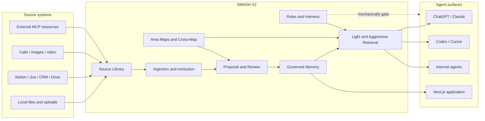

### 24.2 Community Edition Docker Compose architecture

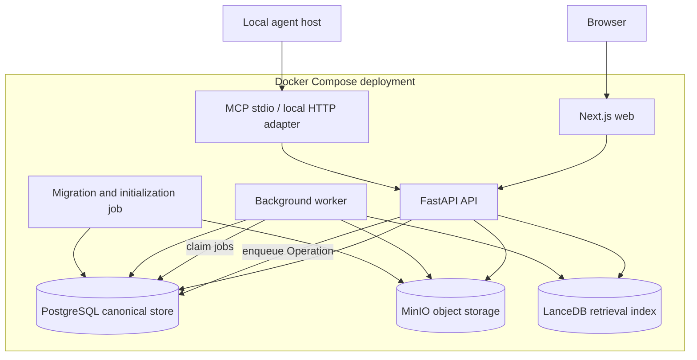

### 24.3 Managed-service evolution after Community Edition

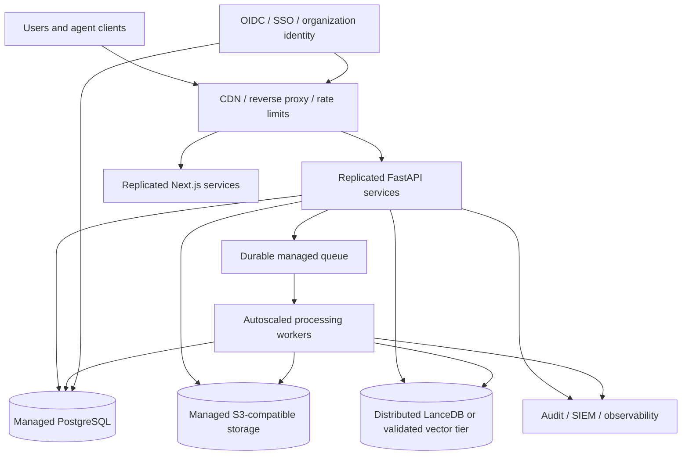

### 24.4 Canonical data and projection relationship

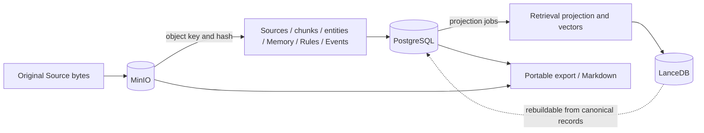

### 24.5 Source ingestion pipeline

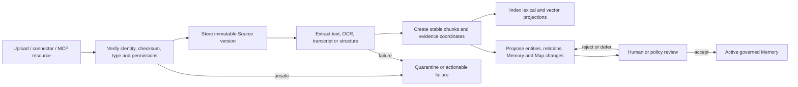

### 24.6 Memory proposal and upsert decision graph

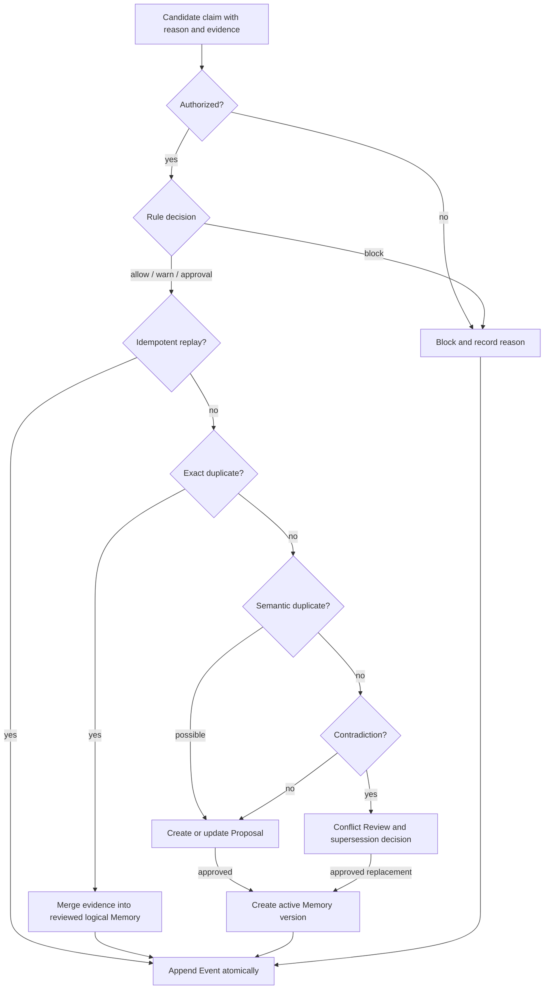

### 24.7 Light and Aggressive retrieval router

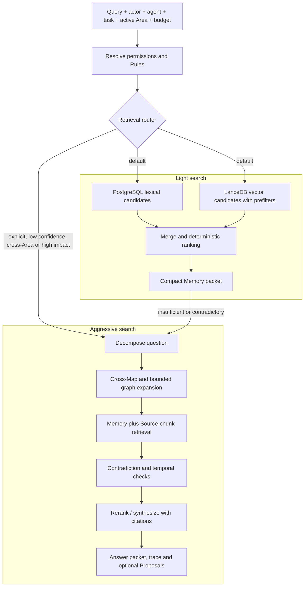

### 24.8 Area Maps and Cross-Map architecture

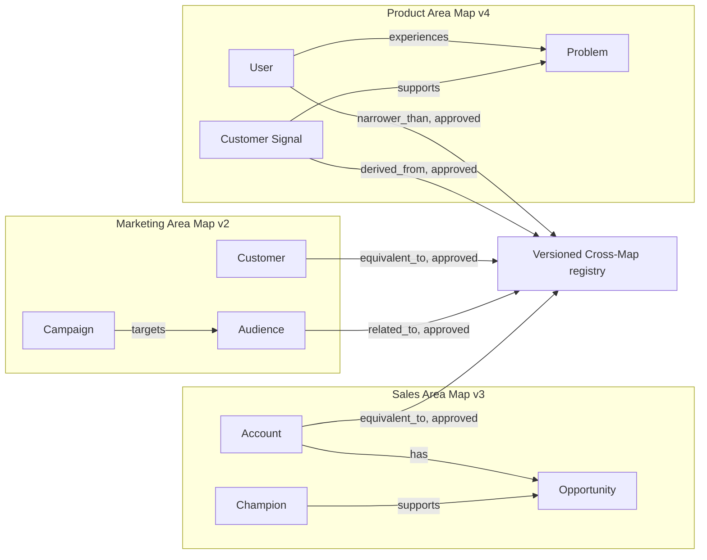

### 24.9 Rule harness around agent actions

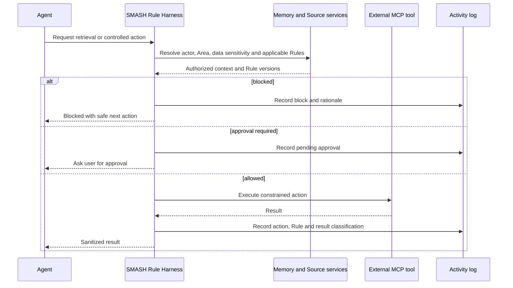

### 24.10 Agent session and memory loop

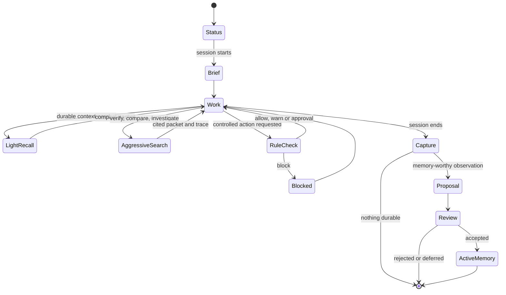

### 24.11 MCP server, consumer, skills, prompts, and registry

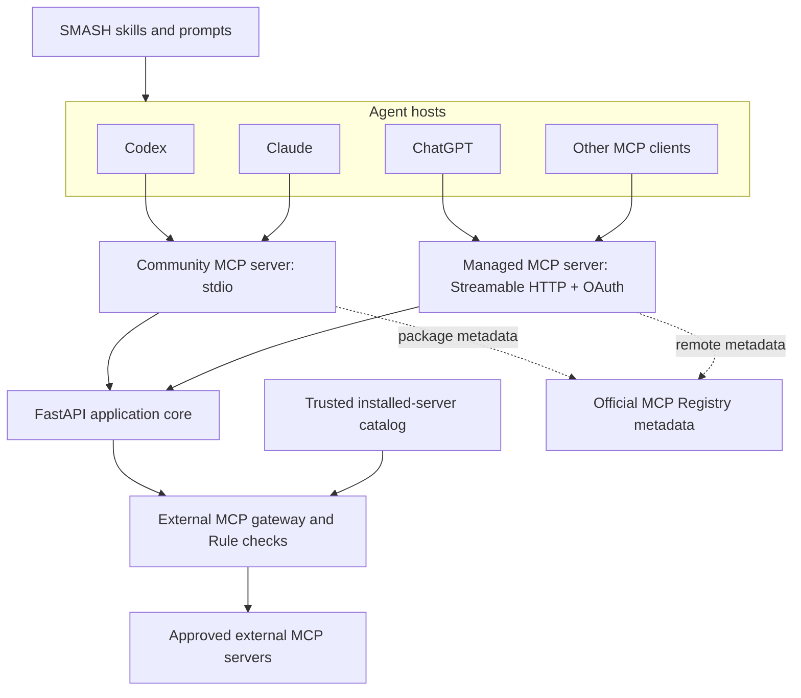

### 24.12 High-level relational model

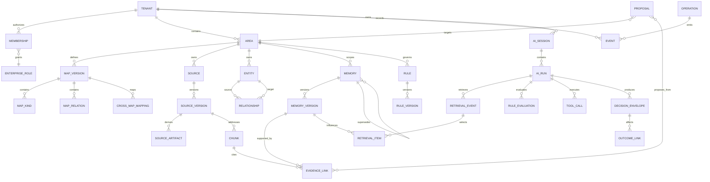

### 24.13 Managed tenant topology

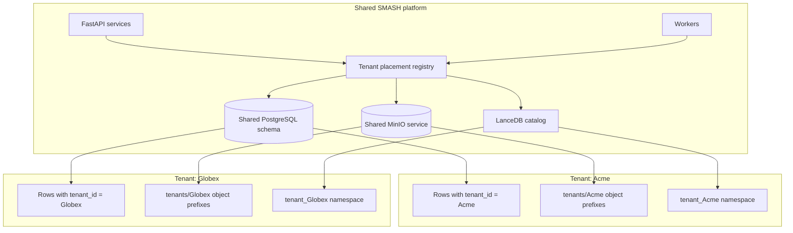

### 24.14 Tenant provisioning state machine

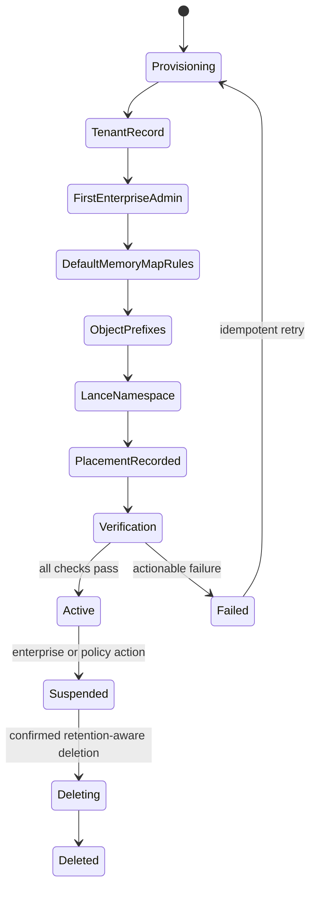

### 24.15 Enterprise role and access model

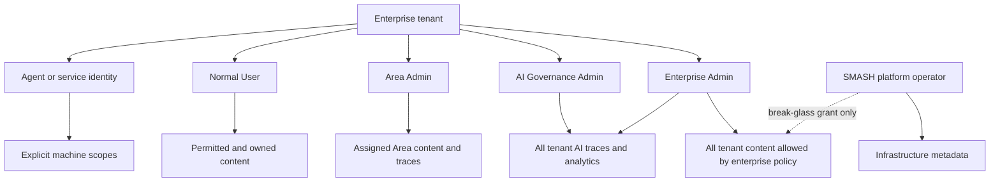

### 24.16 AI decision trace, replay, and outcome graph

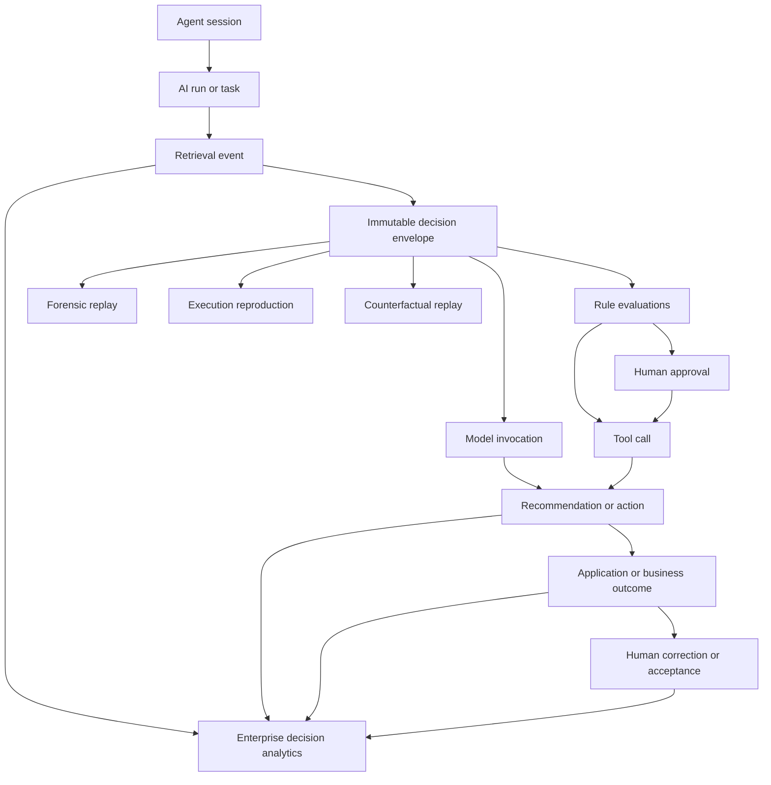

## 25. Primary Technical References

The implementation should verify behavior against current upstream documentation rather than copying examples from secondary tutorials:

- FastAPI container deployment: <https://fastapi.tiangolo.com/deployment/docker/>
- Docker Compose dependency readiness: <https://docs.docker.com/compose/how-tos/startup-order/>
- Next.js self-hosting: <https://nextjs.org/docs/app/guides/self-hosting>
- PostgreSQL documentation: <https://www.postgresql.org/docs/>
- PostgreSQL Row-Level Security: <https://www.postgresql.org/docs/17/ddl-rowsecurity.html>
- PostgreSQL partitioning guidance: <https://www.postgresql.org/docs/current/ddl-partitioning.html>
- MinIO container documentation: <https://min.io/docs/minio/container/index.html>
- LanceDB tables, namespaces and filtering: <https://docs.lancedb.com/tables-and-namespaces> and <https://docs.lancedb.com/search/filtering>
- OpenTelemetry GenAI semantic conventions: <https://opentelemetry.io/docs/specs/semconv/registry/attributes/gen-ai/>
- MCP Registry publishing: <https://modelcontextprotocol.io/registry/quickstart>
- MCP authorization: <https://modelcontextprotocol.io/specification/2025-06-18/basic/authorization>

The existing SMASH repository remains the behavioral reference for V1 contracts:

- `README.md`
- `ARCHITECTURE.md`
- `benchmarks/RESULTS.md`
- `docs/memory-contract.html`
- `docs/mcp.html`
- `docs/scale.html`
- the current tests under `tests/`
