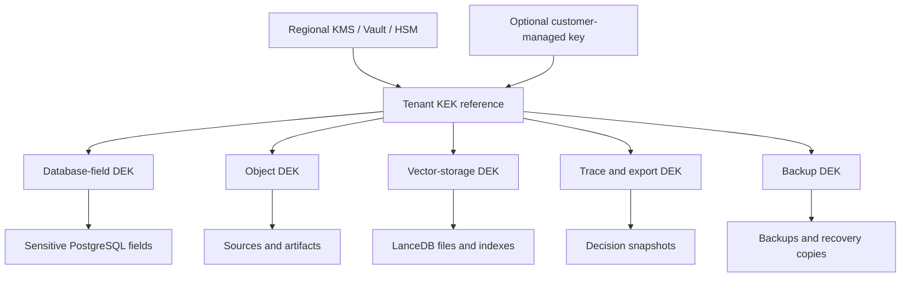
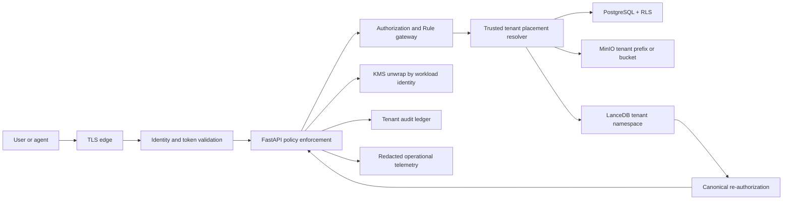
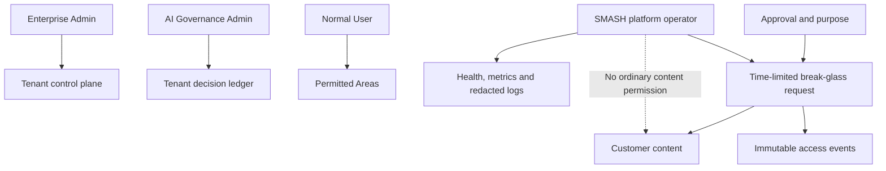
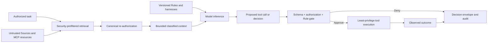
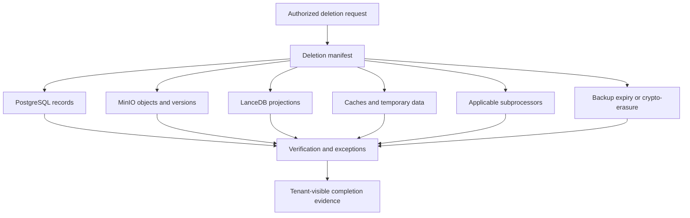

# SMASH V2 Security Architecture and Implementation Specification

**Status:** Companion specification to `SMASH_V2.md`  
**Scope:** Community Edition, managed SMASH, enterprise deployment, AI decision intelligence, MCP, connectors, and future regulated placement  
**Primary stack:** FastAPI, Next.js, PostgreSQL, MinIO-compatible object storage, LanceDB, workers, Docker Compose, MCP adapters

## 1. Purpose

SMASH stores the knowledge that agents use to make decisions. It therefore holds more than ordinary application content. Sources may contain contracts, customer records, meeting transcripts, images, credentials accidentally embedded in documents, personal data, commercial strategy and internal policy. Memory records distill that material into reusable conclusions. Decision envelopes can reveal which evidence an agent saw, what it inferred, which Rules applied, what it attempted and what happened afterward.

This makes the combined SMASH record potentially more sensitive than any individual Source.

This document defines the security architecture required to protect that record. It is an implementation specification, not a certification claim and not legal advice. It describes durable security boundaries, control responsibilities, failure behavior, verification requirements and the differences between Community Edition and the managed product.

Security is successful when:

- one tenant cannot discover, retrieve, infer or mutate another tenant's data;
- a user or agent cannot exceed its enterprise and Area permissions;
- SMASH platform operation does not imply routine access to customer content;
- Sources, Memory, vectors, traces, exports and backups remain protected at rest and in transit;
- every sensitive operation has an attributable identity, purpose and audit record;
- external models, MCP servers and connectors receive only explicitly authorized data;
- deletion, retention, residency and key revocation behave predictably;
- security controls remain effective during degraded operation, recovery and replay;
- Community Edition is honest about which controls are supplied by SMASH and which belong to its operator.

## 2. Security Principles

### 2.1 The Enterprise tenant is the primary security boundary

Every customer organization is represented by an immutable opaque `tenant_id`. Every tenant-owned canonical record, object, vector projection, event, trace and job carries or resolves through that identifier. Slugs, usernames, folder names, email domains and client-provided paths are presentation data, never authorization boundaries.

A unified PostgreSQL cluster or shared object store is an infrastructure choice. It does not weaken the logical ownership boundary. Authorization must produce the same result whether tenants share infrastructure or occupy dedicated placements.

### 2.2 Authentication, authorization, encryption and residency solve different problems

- **Authentication** establishes which human, agent or service is acting.
- **Authorization** decides what that identity may do with specific tenant data.
- **Encryption** reduces exposure if storage, traffic, backups or credentials are compromised.
- **Residency** constrains where defined data is stored or processed.
- **Auditability** establishes what occurred and under whose authority.

No one control substitutes for the others. An encrypted database still leaks data through an overprivileged API. Row-Level Security does not protect a stolen disk. EU storage does not prevent an unauthorized administrator from reading content. Audit logs do not prevent a destructive action.

### 2.3 Least privilege is applied to people, agents and services

The browser, API, worker, migration job, object initializer, indexer, MCP adapter, connector and observability pipeline use separate identities where their privileges differ. Root credentials are bootstrap-only. The normal application role cannot administer the database, object store or KMS.

Agents receive no ambient authority merely because they operate for an authorized user. Each run is bound to an acting identity, tenant, active Area, permitted purposes and a versioned tool set. Tool execution passes through the same authorization and Rule gateway as human API requests.

### 2.4 Default deny and fail closed

Missing tenant context, ambiguous identity, stale membership, failed key resolution, unknown visibility, invalid token audience, absent Rule evaluation or unavailable authorization dependencies result in denial. Search may degrade from semantic to lexical when LanceDB is unavailable, but it must never degrade into broader visibility.

### 2.5 Source content is data, not authority

Text, images, transcripts, webpages, connector records, MCP resources and retrieved Memory may contain malicious instructions. They are evidence presented to a model, not executable policy. Only versioned SMASH Rules, approved prompts, skills and host controls may authorize actions.

### 2.6 Canonical data and derived projections have different trust

PostgreSQL is the authorization and canonical-record authority. MinIO stores large canonical bodies and artifacts. LanceDB is a rebuildable retrieval projection. A vector result is only a candidate. The API rehydrates and re-authorizes the canonical record before disclosure.

### 2.7 Security claims must state their scope

SMASH must not claim "customer-managed encryption," "EU residency," "zero access," or "complete deletion" without specifying:

- which data classes are covered;
- which services, replicas and backups are covered;
- which transient, identity, billing and operational data are excluded;
- who controls the keys;
- whether support access is technically possible;
- how long caches, logs and backups persist;
- what happens when a key is unavailable or revoked.

## 3. Assets and Data Classification

### 3.1 Protected assets

Protected customer assets include:

- original Source bytes and all Source versions;
- extracted text, OCR, transcripts, page images and metadata;
- Memory, proposals, reasons, evidence, contradictions and supersession history;
- Map, Cross-Map, ontology, entity and relationship records;
- Rules, harnesses, prompts, skills and agent configurations;
- vector embeddings and retrieval metadata;
- connector credentials, OAuth tokens and webhook secrets;
- MCP registrations, grants, tool definitions and resource snapshots;
- user profiles, memberships, role grants and Area permissions;
- AI sessions, runs, retrievals, model calls, tool calls and approvals;
- decision envelopes, replay inputs, outputs, outcomes and feedback;
- exports, backups, restore artifacts and deletion evidence;
- encryption metadata, wrapped data keys and key-version references;
- audit records and security events.

### 3.2 Classification levels

SMASH uses a small mandatory classification vocabulary. Enterprises may add labels, but they cannot weaken the platform meanings.

| Level | Meaning | Examples | Default handling |
|---|---|---|---|
| Public | Deliberately publishable | Public product material | Tenant authorization still applies unless explicitly published |
| Internal | Ordinary enterprise information | Team notes, approved process Memory | Encrypted, authenticated, tenant and Area scoped |
| Confidential | Commercially or personally sensitive | CRM records, contracts, customer calls | Restricted sharing, external-model policy, stronger logging controls |
| Restricted | Highest sensitivity | Credentials, regulated records, investigations | Explicit grants, limited processing, possible dedicated placement |
| Secret | Authentication material rather than knowledge | API keys, OAuth refresh tokens, signing keys | Secret manager only; never retrievable as ordinary content |

Classification propagates from Sources to chunks, derived artifacts, proposed Memory, embeddings and trace snapshots unless an authorized review explicitly changes it. Derived summaries are not automatically less sensitive. An embedding inherits at least the classification and residency of the content used to create it.

### 3.3 Data inventory and lineage

Every persistent data class has an owner, canonical store, classification, residency behavior, retention rule, deletion method, backup behavior and encryption profile. Source lineage records connect original bytes to extraction, chunks, embeddings, Memory proposals, decisions and outcomes. This inventory supports access reviews, incident response, deletion and future data-protection impact assessments.

## 4. Threat Model

SMASH assumes attackers or failures may include:

- an unauthenticated internet client;
- a legitimate user attempting to cross an Area or tenant boundary;
- a malicious or compromised Enterprise Admin;
- a compromised browser session, API token, agent host or connector credential;
- a malicious document containing indirect prompt injection;
- a hostile MCP server, MCP client or registry entry;
- a vulnerable dependency, container or CI workflow;
- a platform operator abusing infrastructure access;
- an external model or subprocessor retaining or misusing submitted content;
- object-path manipulation, stale vector metadata or index poisoning;
- SQL injection, server-side request forgery, cross-site scripting or request forgery;
- accidental logging of customer content or credentials;
- stolen disks, snapshots, backups or object-store credentials;
- KMS unavailability, key deletion or incorrect rotation;
- regional outage, partial restore or inconsistent deletion;
- compromised worker jobs or queues that lose tenant context;
- replay that accidentally repeats an external side effect.

The initial architecture does not claim protection against a fully compromised host that simultaneously has application execution privilege, active KMS decrypt permission and access to plaintext in process memory. Higher-assurance customers reduce that exposure through dedicated placement, narrowly scoped KMS policies, private networking, hardened compute, confidential-computing options where validated, and stronger operational separation.

## 5. Identity and Session Security

### 5.1 Identity classes

The system distinguishes:

- human customer identities;
- enterprise service accounts;
- agents acting on behalf of a human;
- autonomous agents with their own constrained service identity;
- internal workloads such as API, worker and indexer;
- SMASH platform operators;
- emergency break-glass identities.

Identity type is part of the audit record. A service account must never masquerade as a human, and an agent run must preserve both the agent identity and the authorizing user or service principal.

### 5.2 Managed authentication

Managed SMASH should support OpenID Connect first, then SAML where required, with enterprise SSO, enforced MFA through the identity provider and SCIM lifecycle management. Authentication tokens are validated for signature, issuer, audience, expiry, not-before time and required assurance. Tenant selection is derived from verified membership, never accepted solely from a request header or URL.

Sessions use secure, HTTP-only, same-site cookies for the web application or short-lived bearer tokens for APIs. Refresh tokens are rotated and stored encrypted. Sensitive changes require recent authentication or step-up authentication according to enterprise policy.

### 5.3 Community authentication

Community Edition may include a documented local-only development mode. That mode binds to loopback or a trusted private network and is visibly unsafe for public exposure. A production Community deployment must configure authentication, unique secrets and TLS. The built-in tenant and first Enterprise Admin still use the complete identity and membership model.

### 5.4 Session revocation

Disabling a user, removing membership, changing a high-risk role, revoking a connector or activating an incident lock invalidates relevant sessions and cached authorization promptly. Long-lived worker jobs re-check authorization before sensitive finalization rather than relying indefinitely on the permissions present when queued.

## 6. Authorization and Tenant Isolation

### 6.1 Authorization inputs

An authorization decision is the intersection of:

- authenticated actor and identity type;
- `tenant_id` and active membership;
- enterprise role and explicit capabilities;
- Area membership and object-level grants;
- visibility and classification;
- purpose and requested action;
- versioned enterprise Rules;
- resource state, retention and legal hold;
- delegation or user consent for an agent;
- support-access grant where applicable.

Roles provide defaults; capabilities express exact permissions. Critical capabilities include tenant administration, content-wide read, AI-governance read, Area management, source export, Rule publication, connector administration, key administration, audit export and break-glass approval.

### 6.2 PostgreSQL enforcement

Every tenant-owned table includes immutable `tenant_id`. Application queries constrain tenant explicitly, and PostgreSQL Row-Level Security supplies defense in depth. RLS policies are default-deny and cover reads and mutations. The normal application and worker roles neither own protected tables nor have `BYPASSRLS`. Migration ownership is separate from runtime access.

Tenant context is set transaction-locally from verified server-side authentication. Connection-pool reuse must clear context automatically. Tests attempt cross-tenant access through every API path, background job and direct repository operation. Security-definer functions are minimized and reviewed.

RLS does not replace application authorization. PostgreSQL can constrain tenant rows; the application still resolves Area grants, purposes, Rules, private-Area exclusions and object state.

### 6.3 Object-store enforcement

Object keys begin with a trusted server-resolved tenant prefix such as `tenants/{tenant_id}/`. Clients never supply full storage paths. Database records store opaque object identifiers and verified hashes. The API authorizes the canonical record before generating a short-lived, method-specific presigned request.

Object-store service identities receive only required bucket actions. Browser credentials, root credentials and unrestricted cross-tenant listing are forbidden. Dedicated buckets or accounts can replace prefixes for stronger isolation without changing application identifiers.

### 6.4 LanceDB enforcement

The placement registry resolves `tenant_id` to a trusted LanceDB catalog, namespace and table set. The user cannot choose a namespace. PostgreSQL authorization produces permitted Areas, classifications and object states before vector search. Those values become retrieval prefilters; retrieval does not search globally and discard forbidden results afterward.

Every vector row references a canonical PostgreSQL identifier. The API re-authorizes and rehydrates every candidate before returning content. Missing, stale or mismatched metadata causes exclusion and reconciliation. Worker identities own vector writes; API identities query. Index corruption must reduce availability, not authorization.

### 6.5 Administrative access

An Enterprise Admin is a customer role inside one tenant. It may receive tenant-wide access according to enterprise policy. An AI Governance Admin may inspect tenant decision records without automatically gaining unrelated platform administration. Exceptional private Areas can exclude broad administrative content access if the enterprise enables that policy.

A SMASH platform operator is not a customer Enterprise Admin. Infrastructure administration creates technical risk but no ordinary application permission to read customer content. Support access requires the break-glass process in Section 15.

## 7. Encryption and Key Management

### 7.1 Encryption objectives

SMASH encrypts:

- traffic over untrusted and production service networks;
- persistent PostgreSQL storage and backups;
- MinIO objects, versions and replication targets;
- LanceDB files, indexes and object-store projections;
- connector and MCP credentials using application envelope encryption;
- classified trace and replay snapshots;
- exports and temporary processing artifacts;
- queue payloads when they contain customer content.

Encryption metadata is designed for rotation. Ciphertext records identify algorithm, key reference, key version and format version without exposing the key.

### 7.2 Envelope-encryption hierarchy

The managed design uses envelope encryption:

1. A regional KMS or approved Vault/HSM protects root key material.
2. Each tenant has an encryption profile and tenant key-encryption-key reference.
3. Purpose-specific data-encryption keys protect database fields, objects, vectors, credentials, traces, exports and backups.
4. Only wrapped data keys are stored with application metadata.
5. An authorized workload asks KMS to unwrap the necessary key for a bounded operation.
6. Plaintext keys and data exist only in process memory for the minimum required duration.

Standard managed tenants use SMASH-managed regional keys with tenant-scoped data keys. Enterprise tenants may select a customer-managed key. Dedicated placement may use an entirely separate KMS account, vault or HSM-backed key hierarchy.

### 7.3 Application-level field encryption

Storage encryption protects media and snapshots but may not prevent a broadly privileged database operator from reading live rows. Highly sensitive fields therefore support authenticated application-level encryption using a vetted library and an approved authenticated-encryption mode such as AES-256-GCM. The exact cryptographic library and format require security review; SMASH must not implement cryptographic primitives itself.

Associated authenticated data binds ciphertext to its tenant, record, field, schema version and purpose so ciphertext cannot be silently moved between records. Nonces are generated according to the library's requirements and never reused with the same key. Decryption failures are security events, not empty values.

Not every column should be encrypted at application level. Tenant IDs, opaque canonical IDs, status codes, timestamps and query dimensions may remain plaintext where needed for enforcement and operations. Sensitive free text, credentials, selected personal attributes, prompt bodies, tool payloads and decision snapshots are stronger candidates.

Encrypted fields cannot be searched normally. Where equality lookup is necessary, use a separately keyed blind index after cryptographic review. Do not introduce deterministic encryption casually. Full-text and semantic search use classified projections with their own access controls and keys.

### 7.4 Key custody and service permissions

KMS permissions are granted to workload identities, not individual engineers. Each workload can decrypt only the tenant and purpose keys needed for its function. CI systems cannot decrypt production customer data. Observability systems cannot decrypt content. Database and object-store administrators do not automatically receive KMS permission.

Key administration and content administration are separable enterprise capabilities. High-risk actions such as customer-key replacement, revocation, re-encryption and recovery require strong authentication, explicit confirmation and immutable audit events.

### 7.5 Rotation and re-encryption

Key rotation has two meanings:

- **wrapping-key rotation:** rewrap existing DEKs without rewriting all customer content;
- **data-key rotation:** new writes use a new DEK while old versions remain available for decryption until re-encrypted or expired.

Rotation jobs are idempotent, resumable and observable. They record counts, failures and versions without logging plaintext. Rotation does not claim completion until live data, object versions, backups in scope and restore procedures have been evaluated.

### 7.6 Revocation, key loss and crypto-erasure

Customer-managed key revocation must fail closed for covered data and clearly move the tenant into a key-unavailable state. The system must distinguish deliberate revocation from temporary KMS failure. Restoration requires an authorized customer administrator and records all attempts.

Key destruction can support crypto-erasure only when all covered copies use that key and no plaintext or independently decryptable copy remains. Retained backups, exports, caches, model-provider copies and logs must be included in the scope statement. Key loss without an approved backup or recovery mechanism can make data permanently unrecoverable.

### 7.7 KMS availability

KMS is a production dependency. Key caches, if used, are memory-only, short-lived, bounded, tenant-aware and cleared on revocation signals where technically possible. The platform monitors unwrap latency, denial, throttling, expiry and key-state changes. It never falls back to plaintext persistence when KMS is unavailable.

## 8. Storage-Specific Security

### 8.1 PostgreSQL

PostgreSQL security requires:

- encrypted volumes or managed storage encryption;
- TLS for production connections with certificate validation;
- separate migration, application, worker, backup and read-only operational roles;
- mandatory tenant IDs and RLS on tenant-owned tables;
- no runtime table ownership or `BYPASSRLS`;
- parameterized queries and controlled dynamic SQL;
- encrypted sensitive fields and credentials;
- encrypted backups with restore testing;
- restricted extensions and network reachability;
- query and audit logging that redacts content and secrets;
- connection-pool tests preventing tenant-context leakage.

Database superuser use is exceptional and audited at the infrastructure layer. Application support tools expose safe, purpose-built diagnostics rather than handing engineers a general production SQL console.

### 8.2 MinIO-compatible object storage

Production object storage uses server-side encryption connected to a KMS, TLS, versioning according to policy, restricted service identities and block-public-access behavior. KMS should be operationally separated from the object store rather than storing the only usable keys beside the encrypted data.

Uploads follow a staged protocol: authorize intent, allocate an opaque object key, upload with size and media constraints, verify checksum and type, scan where applicable, finalize the canonical Source version, then enqueue extraction. Unfinalized uploads expire automatically.

Presigned requests are short-lived, limited to one object and one method, and never authorize listing. Response headers prevent active content from executing in the SMASH origin. Downloads use safe disposition and media-type handling.

### 8.3 LanceDB and embeddings

LanceDB storage is encrypted at the object or volume layer and protected by tenant-specific placement and key policy. Standard vector search still requires readable vectors inside trusted compute memory. SMASH must not claim that ordinary vector similarity search operates directly over opaque encrypted vectors.

Embeddings can reveal semantic information and enable membership or reconstruction attacks. They are classified customer data. SMASH therefore:

- never mixes tenant rows in an unfiltered global search;
- minimizes metadata stored alongside vectors;
- prevents direct browser or arbitrary-agent access;
- records embedding model, version, input hash and classification;
- verifies model-provider retention and residency before sending text;
- supports deletion and full index rebuild from canonical stores;
- detects poisoned, duplicate and unexpectedly broad projections;
- offers dedicated vector placement for regulated tenants.

### 8.4 Queues, caches and temporary files

Jobs carry signed or server-created tenant and actor context, not arbitrary client context. Queue consumers re-resolve placement and authorization. Sensitive payloads contain canonical references where possible rather than full Source bodies.

Caches include tenant, authorization version and classification in their keys. Cross-tenant shared cache entries are forbidden for customer content. Temporary extraction files use restricted directories or isolated ephemeral storage, are never served directly and are deleted after bounded processing. Container layers and crash dumps must not capture plaintext customer content.

### 8.5 Backups and replicas

Backups are encrypted with a distinct backup key policy, regionally placed, access-controlled, versioned and restoration-tested. PostgreSQL, objects, encryption metadata and required configuration must form a recoverable set. LanceDB can be rebuilt, but the recovery plan documents the time and model versions necessary to do so.

Replication targets, snapshots and disaster-recovery copies follow the tenant's residency and key scope. A customer-managed key feature is incomplete if backups silently use an unrelated provider-managed key without disclosure.

## 9. Network and Runtime Boundaries

The public edge exposes only required web, API, OAuth and remote MCP endpoints. PostgreSQL, MinIO administration, LanceDB storage, KMS, internal queues and worker control surfaces are private.

Production traffic uses TLS. Internal service TLS or authenticated private networking is required according to deployment risk. Certificates rotate automatically. Egress is default-restricted for extraction workers and connector runners: destinations are allowlisted by connector, DNS rebinding is addressed, private and metadata-service addresses are blocked, redirects are revalidated, and downloads have size and time limits.

Connectors and risky document processors should run in isolated workers with minimal filesystem, process and network privilege. Containers run as non-root, use read-only filesystems where feasible, drop unnecessary Linux capabilities and mount only required secrets and storage.

Tenant placement includes region and isolation tier. A request is routed to the tenant's data plane before content access. The system rejects accidental cross-region processing rather than silently sending content elsewhere.

## 10. API and Web Application Security

FastAPI is the canonical security boundary for web, MCP and connector use cases. The Next.js server and browser do not bypass it to query PostgreSQL, MinIO or LanceDB directly.

Required API controls include:

- strict request and response schemas;
- bounded body, file, query and pagination sizes;
- parameterized persistence operations;
- server-generated tenant and object placement;
- idempotency for retryable mutations;
- rate and concurrency limits by tenant, actor and operation;
- safe error messages with internal correlation IDs;
- content-security policy and anti-clickjacking headers;
- CSRF protection for cookie-authenticated mutations;
- secure cookie attributes and origin validation;
- output encoding and sanitization for rendered Markdown and extracted HTML;
- protection against mass assignment and insecure direct object references;
- explicit export and bulk-operation authorization;
- no credentials or sensitive bodies in URLs.

OpenAPI is treated as a security-relevant artifact. Internal fields, encrypted values and operator-only routes must not leak into generated public clients. Debug mode, interactive API documentation and detailed exception pages are disabled or separately protected in production.

## 11. AI, Retrieval and Prompt-Injection Security

### 11.1 Trust ordering

The prompt assembly process preserves a visible trust hierarchy:

1. platform safety and mechanical host controls;
2. enterprise Rules and approved harnesses;
3. authorized user task and purpose;
4. approved prompt and Skill versions;
5. retrieved Memory and Sources as quoted evidence;
6. external tool and MCP content as untrusted data.

Models do not decide authorization. They may recommend actions, classify content or flag risk, but deterministic services enforce identity, permissions, Rules, budgets and tool schemas.

### 11.2 Retrieval safety

Authorization occurs before candidate generation. Retrieval packets are bounded and label every item with Source, status, validity, classification, Area, reason and evidence. Conflicting and superseded Memory remains distinguishable. Content from one item cannot redefine the authority of another.

Light search remains deterministic enough to inspect. Aggressive search records query expansion, traversed Maps, model involvement and rejected candidates. Cross-Map retrieval requires an approved Cross-Map path and preserves the originating Area and disclosure policy.

### 11.3 Source ingestion safety

Parsers do not execute macros, embedded scripts, shell commands or Source-provided instructions. Archives have file-count, nesting and expansion limits. Media processing is isolated and patched. URLs are fetched through SSRF-resistant controls. Malicious content can be quarantined while metadata remains available to authorized reviewers.

Proposal generation marks Source content as untrusted evidence. A Source cannot directly publish a Rule, approve Memory, install a Skill, register a connector or authorize a tool.

### 11.4 Model-provider controls

Each model endpoint has policy metadata covering provider, region, retention, training use, subprocessor terms, supported classifications and approved purposes. Before inference, the policy engine evaluates tenant, classification, residency and task. Restricted content may require a customer-controlled or self-hosted model.

Prompts send the minimum necessary context. Provider credentials are tenant- or deployment-scoped, encrypted and never exposed to agents. Model requests and responses receive stable trace identifiers, but operational logs omit bodies.

### 11.5 Tool execution

Model output is untrusted proposed input. Tool calls are schema-validated, authorized and evaluated against Rules immediately before execution. High-impact actions require approval or a narrowly defined pre-authorization. File paths, URLs, SQL, shell fragments and external recipient identifiers receive tool-specific validation.

The model cannot expand its own scopes, register new tools, disable logging, change Rules or approve its own proposal. Side-effecting operations use idempotency keys and record outcomes.

## 12. MCP, Registry and Connector Security

### 12.1 SMASH as an MCP server

The MCP adapter calls the same application services as the HTTP API. It has no alternate authorization or storage path. Remote MCP uses OAuth-compatible authorization, short-lived tokens, exact audience validation, protected-resource metadata and HTTPS. Token passthrough is forbidden. MCP session identifiers are correlation values, not authentication credentials.

Scopes are capability-oriented and narrow. Administrative, export and Rule-publication tools are separated from normal recall and proposal tools. Responses contain only authorized bounded content and safe structured errors.

Local stdio MCP inherits significant authority from its host. Documentation must explain that any process able to invoke the server or read its environment may act with those credentials. Local tokens are restricted, stored using OS-appropriate secret facilities and never printed in configuration examples.

### 12.2 SMASH as an MCP client

External MCP servers are untrusted integrations. Installation records publisher, package or endpoint, version, transport, requested scopes, data destinations, approval, checksum or signature where available, risk classification and responsible administrator.

The connector gateway protects against confused-deputy behavior. It maintains per-client and per-user consent, validates exact redirects, binds state and PKCE correctly, validates token audiences and never forwards an unrelated upstream bearer token as proof of SMASH authorization.

Tool definitions can change after approval. Material changes in endpoint, publisher, signature, scopes or tool behavior suspend automatic use pending review. Tool outputs and resources are treated as untrusted Source data.

### 12.3 MCP Registry

Registry presence is discovery metadata, not a security endorsement. SMASH verifies the server identity and release metadata it publishes, but customers still approve installation and scopes. A managed registry view should show verification state, publisher, permissions, data egress, residency implications, version history, incident state and revocation.

### 12.4 Native connectors

Connector credentials are encrypted secrets with tenant ownership and purpose-specific decrypter permission. OAuth scopes are minimal. Webhooks verify signature, freshness and replay protection. Incremental sync preserves external IDs and permission changes. A Source imported while permitted is not automatically available forever: connector permission changes trigger policy evaluation, restriction or deletion according to the configured ownership model.

## 13. Decision Traces, Replay and Analytics

The tenant decision ledger is customer product data, not ordinary telemetry. It can reveal more than a Source because it connects people, evidence, policy, model behavior and business outcomes.

Decision-envelope capture is configurable by classification and enterprise policy. PostgreSQL stores queryable relationships and hashes. Large prompt, response, retrieval and tool snapshots live encrypted in MinIO with explicit retention. Operational observability receives opaque identifiers, timings, counts, statuses and error categories—not raw customer content.

AI Governance Admin access is tenant-scoped and audited. Normal Users see only runs permitted by Area, ownership and sharing policy. Platform operators see service health without content. Cross-tenant product analytics use consented, aggregated and minimum-cohort data; raw prompts, Memory and decisions are never pooled silently.

Replay is safe by default:

- external side effects are mocked or use recorded results;
- connector and tool credentials are not replayed automatically;
- the original versions and classification are preserved;
- authorization is checked for the person initiating replay;
- replay runs in a sandbox and receives its own trace;
- any live side effect requires explicit mode, renewed authorization and approval.

## 14. Logging, Audit and Detection

### 14.1 Operational telemetry

Structured logs include request, tenant, actor, agent, session, run, operation and trace identifiers where applicable. Logs exclude authorization headers, cookies, OAuth codes, connector secrets, plaintext encryption keys, raw prompts, Source bodies and full tool payloads. Redaction occurs before log export.

Metrics are content-free by default: latency, queue depth, error rates, candidate counts, rule outcomes, model/provider identifiers, token estimates, KMS health and storage health. Tenant identifiers sent to centralized observability may be pseudonymous where operationally sufficient.

### 14.2 Customer audit ledger

Security-relevant customer events include:

- login, logout, failed authentication and session revocation;
- membership, role, Area and capability changes;
- Source access, bulk export and deletion;
- Rule, prompt, Skill and connector publication;
- MCP installation, scope and consent changes;
- key configuration, rotation, revocation and restoration;
- decision replay and approval;
- break-glass request, approval, access and termination;
- retention, legal hold and deletion operations.

Audit records are append-only through normal application paths, time-synchronized, tenant-owned and exportable. Integrity protection may use restricted storage, immutability controls and verifiable chaining, but the system must not overstate tamper-proofness while privileged infrastructure identities can modify the underlying environment.

### 14.3 Detection

Security detection covers cross-tenant denials, enumeration, unusual exports, repeated presigned-URL failures, token misuse, connector destination changes, privilege escalation, KMS anomalies, unexpected vector-result exclusions, prompt-injection indicators, high-risk tool denials and break-glass activity.

Alerts contain enough context to investigate without copying sensitive bodies into paging systems.

## 15. Platform Operations and Break-Glass Access

Normal platform operation uses dashboards, health endpoints, metrics, redacted logs and safe tenant-status tools. It does not require browsing customer Sources or Memory.

When content access is genuinely necessary, break-glass requires:

1. an incident or customer support case;
2. a named operator with strong authentication;
3. tenant, purpose, requested capabilities and exact scope;
4. customer approval where contractually required and operationally possible;
5. independent approval for high-risk access;
6. short expiration and no standing reuse;
7. visible activation and immutable audit events;
8. session recording or command logging appropriate to the access path;
9. post-access review and customer-visible summary.

Emergency access that cannot wait for customer approval is narrowly defined in policy, alerts security leadership immediately and is reported afterward. Break-glass permission never grants access to customer-managed keys unless the customer key policy explicitly permits the required service operation.

## 16. European Privacy, Residency and Governance

### 16.1 GDPR posture

For managed SMASH, the enterprise will commonly act as controller for its content while SMASH acts as processor, subject to the contract and actual processing purposes. Roles must be confirmed legally for any SMASH-controlled analytics or product-improvement use.

Encryption supports GDPR security of processing but does not create compliance alone. The program also requires purpose limitation, data minimization, accuracy, retention, rights handling, resilience, restoration, testing, incident response, processor governance and demonstrable accountability.

### 16.2 Regional placement

Tenant provisioning records the chosen region before accepting content. PostgreSQL, object storage, vectors, queues, caches, search processing, trace snapshots, backups and disaster recovery remain inside the promised region. Model inference and connector traffic are evaluated separately because data may leave the SMASH region by customer request.

SMASH publishes an explicit residency matrix for:

- canonical customer content;
- embeddings and indexes;
- identity and account data;
- billing data;
- operational logs and security events;
- support systems;
- email and notification delivery;
- model providers and connectors;
- backups and disaster recovery;
- transient processing and caches.

### 16.3 Privacy operations

The product supports tenant export, targeted subject search, correction, deletion, retention holds and evidence of completion without granting platform personnel broad content access. Enterprises configure lawful retention and determine when approved Memory must remain as business evidence despite deletion of a superseded Source, subject to applicable law and policy.

Privacy-preserving product analytics collect the minimum necessary events, separate customer product records from SMASH usage telemetry, support tenant opt-out where required and avoid sending content to generic analytics platforms.

### 16.4 Subprocessors and international transfer

Each managed external provider is inventoried with purpose, data types, location, retention, training policy, security terms and transfer mechanism. Enabling a model or connector that changes data destination is an informed enterprise action, not an invisible platform decision.

## 17. Retention, Deletion and Export

Retention is defined by data class, tenant policy and legal hold. Sources, Memory, traces, logs, temporary files, connector tokens, exports and backups can have different periods. "Delete" is a stateful coordinated operation rather than a single SQL statement.

A deletion operation:

1. immediately removes ordinary authorization where required;
2. marks canonical records and creates a deletion manifest;
3. removes or tombstones derived chunks and vectors;
4. removes current and versioned objects according to policy;
5. invalidates caches and presigned URLs;
6. propagates to replicas and subprocessors where applicable;
7. handles backups through expiry or approved crypto-erasure;
8. records completion, exclusions, legal holds and failures.

Exports are encrypted, short-lived, integrity-checked and access-controlled. Export generation is an auditable high-risk operation. The default export contains customer records and lineage but never SMASH-managed secret material or unrelated tenants.

## 18. Secrets Management

Secrets do not belong in Markdown, Source records, container images, frontend bundles, Git history, logs or ordinary PostgreSQL text columns.

Production uses a secret manager or workload identity for database credentials, object-store credentials, KMS access, signing keys, connector tokens and provider API keys. Services receive only the secrets they require. Secrets have owners, purpose, tenant where applicable, creation and expiry information, rotation procedure and revocation path.

The UI never redisplays stored secret plaintext. It shows metadata, last validation and replacement controls. Support personnel cannot retrieve secrets. Secret scanning runs in development and CI, and committed credentials are treated as compromised even if later deleted from the branch.

## 19. Secure Development and Supply Chain

The repository enforces review for security-sensitive paths, including authentication, authorization, RLS, cryptography, presigned URLs, parser execution, MCP authorization, connector OAuth, Rules and deployment manifests.

The delivery process includes:

- dependency locking and automated vulnerability review;
- static analysis, secret scanning and infrastructure-policy checks;
- container and base-image scanning;
- generated software bills of materials;
- signed release artifacts and provenance where feasible;
- minimal pinned production images;
- migration review and downgrade considerations;
- patch policy for critical dependencies and parsers;
- protected release credentials and separation from pull-request code;
- documented vulnerability disclosure and coordinated remediation.

Third-party parsers, model SDKs, embedding libraries, MCP packages and frontend Markdown renderers receive special attention because they process untrusted content or operate near sensitive data.

## 20. Security Testing and Release Gates

Security verification is automated where possible and includes:

### 20.1 Tenant and authorization tests

- cross-tenant reads, writes, search, exports and object access;
- Normal User, Area Admin, AI Governance Admin and Enterprise Admin boundaries;
- private-Area exclusions;
- RLS behavior under API, worker and migration roles;
- connection-pool tenant-context reuse;
- stale membership and revoked-session behavior;
- guessed IDs and object keys;
- stale or poisoned LanceDB projections;
- background-job tenant substitution.

### 20.2 Encryption tests

- TLS configuration and certificate validation;
- encrypted storage and backup inspection;
- envelope round-trip and authenticated-data mismatch;
- key-version migration and rotation resume;
- revoked, disabled, missing and throttled key behavior;
- absence of plaintext secrets in logs, database snapshots and exports;
- restore with the correct key and denial with the wrong key;
- customer-managed key suspension and recovery.

### 20.3 AI and integration tests

- direct and indirect prompt injection fixtures;
- malicious PDF, image, webpage and MCP resource content;
- tool-argument injection and unauthorized side effects;
- vector poisoning and unauthorized semantic matches;
- model-provider classification and residency denial;
- MCP audience errors, token passthrough and confused-deputy cases;
- connector webhook replay, SSRF and scope reduction;
- safe replay with no live external side effects.

### 20.4 Application and infrastructure tests

- standard web and API vulnerability testing;
- upload bombs, parser crashes and resource exhaustion;
- dependency and container scanning;
- non-root and filesystem restrictions;
- backup restoration and regional disaster recovery;
- audit completeness and redaction;
- rate-limit and denial-of-service behavior;
- break-glass expiry and notification.

A security defect capable of cross-tenant disclosure, authorization bypass, secret exposure, arbitrary tool execution or ineffective deletion blocks release.

## 21. Community Edition Security Baseline

Community Edition must provide secure architecture, not enterprise theater. It includes:

- the complete tenant, membership and role data model;
- tenant IDs on all owned records;
- application authorization and PostgreSQL RLS;
- safe server-resolved MinIO and LanceDB placement;
- least-privilege runtime credentials;
- secret redaction and structured audit events;
- safe Source parsing boundaries;
- Rule-gated tools and a small MCP surface;
- secure configuration guidance;
- backup, restore, upgrade and reset documentation;
- dependency scanning and a security disclosure policy;
- an optional integration path for external KMS or Vault where practical.

The default Docker Compose profile is suitable for local evaluation and trusted-network use. Public or enterprise production deployment additionally requires operator-supplied TLS, authentication, secure secret storage, host or volume encryption, backup protection, network controls, monitoring and patch operations unless an opinionated hardened deployment profile supplies them.

Community documentation must say clearly that MinIO and PostgreSQL containers on an unencrypted host volume do not become encrypted merely because SMASH uses access controls. Self-hosting provides control, but the deployer owns infrastructure security and compliance.

## 22. Managed and Enterprise Security Capabilities

Managed SMASH adds:

- enforced SSO, MFA integration and SCIM;
- regional tenant placement and published residency scope;
- managed TLS, private service networks and workload identity;
- managed encrypted storage, backups and disaster recovery;
- regional KMS with tenant-scoped key hierarchy;
- customer-managed key support for defined data classes;
- platform-operator separation and audited break-glass access;
- centralized detection, incident response and security evidence;
- configurable retention, legal hold and privacy workflows;
- dedicated PostgreSQL, object, vector or full-stack placement for selected tenants;
- private connectivity and controlled egress where required;
- audit exports and enterprise security integrations.

Recommended isolation tiers are:

| Tier | Data placement | Key model | Intended use |
|---|---|---|---|
| Community | Operator deployment | Operator-managed | Local teams and self-hosters |
| Managed Standard | Shared regional services, logical tenant isolation | SMASH-managed regional KEK plus tenant DEKs | Normal SaaS customers |
| Managed Enterprise | Shared or dedicated components | SMASH-managed or customer-managed tenant key | Larger enterprises |
| Regulated | Dedicated regional data plane | Customer-controlled or dedicated key hierarchy | Contractually high-assurance workloads |

Moving tiers changes placement and operational controls, not canonical IDs or API meaning.

## 23. Incident Response

The incident process covers detection, triage, containment, evidence preservation, eradication, recovery, customer communication and lessons learned. Runbooks exist for:

- suspected cross-tenant access;
- leaked credential or signing key;
- malicious connector or MCP package;
- compromised model/provider integration;
- object-store exposure;
- KMS outage, revocation or key loss;
- corrupted vector index or poisoned Source corpus;
- compromised platform operator;
- ransomware or destructive deletion;
- residency breach;
- vulnerable parser or dependency under active exploitation.

Incident tooling preserves tenant separation. Investigators receive only necessary access. Regulatory and contractual notification decisions use verified incident facts and legal review. Post-incident work produces durable control changes and tests rather than relying only on staff reminders.

## 24. Security Architecture Diagrams

### 24.1 Managed tenant request and data path

### 24.2 Operator and customer administration separation

### 24.3 Secure AI decision flow

### 24.4 Deletion and crypto-erasure scope

## 25. Security Decision Summary

1. The Enterprise tenant is the primary customer ownership and security boundary.
2. Shared infrastructure does not grant shared visibility.
3. Authentication, authorization, encryption, residency and audit are independent required controls.
4. PostgreSQL is canonical and uses mandatory tenant IDs plus RLS defense in depth.
5. Runtime database roles do not own protected tables and do not receive `BYPASSRLS`.
6. Object and vector placement is resolved from trusted server-side tenant metadata.
7. LanceDB is a rebuildable projection; every result is re-authorized against PostgreSQL.
8. Embeddings are sensitive customer data and ordinary vector search requires plaintext in trusted compute memory.
9. Managed encryption uses regional KMS-backed envelope encryption with tenant and purpose separation.
10. Customer-managed keys are an Enterprise option with explicitly published coverage and failure behavior.
11. SMASH platform operators have no ordinary customer-content authorization.
12. Support content access uses time-limited, approved and audited break-glass grants.
13. Sources, retrieved text, tool results and MCP resources are untrusted data, not authority.
14. Models propose; deterministic services authorize and enforce Rules.
15. The decision ledger is tenant product data and is separated from redacted operational telemetry.
16. EU residency covers only explicitly listed data classes, services and processors.
17. Deletion coordinates canonical data, objects, vectors, caches, subprocessors and backups.
18. Community Edition preserves the security contracts while leaving host infrastructure and operations to the deployer.
19. Managed and dedicated tiers strengthen placement, keys and operations without changing domain identifiers.
20. Security-critical isolation, encryption, AI and recovery tests block release when they fail.

## 26. Implementation Gates

These are capability gates, not timelines.

### Gate A: Security contracts

Define tenant context, identity types, capabilities, classification, audit schema, encryption metadata, placement records, error behavior and threat model. No storage adapter may invent a weaker local convention.

### Gate B: Canonical isolation

Implement memberships, capabilities, Area grants, mandatory tenant IDs, RLS, separate runtime roles and cross-tenant test fixtures. Pass adversarial API, repository and worker isolation tests.

### Gate C: Protected storage

Implement trusted object paths, least-privilege storage identities, TLS, secure upload finalization, secret management, encrypted backups and safe temporary processing. Document host responsibilities for Community Edition.

### Gate D: Retrieval security

Implement tenant namespace resolution, authorization prefilters, canonical re-authorization, classification propagation, deletion reconciliation and vector-poisoning tests. Demonstrate that index loss or corruption cannot broaden access.

### Gate E: AI and tool safety

Implement trust-delimited context, model-provider policy, prompt-injection fixtures, deterministic Rule enforcement, approvals, bounded tool scopes and safe replay. Demonstrate that model output cannot authorize itself.

### Gate F: MCP and connector security

Implement remote MCP authorization, audience validation, short-lived tokens, consent, safe registry metadata, encrypted connector secrets, webhook verification, SSRF controls and scope-revocation behavior.

### Gate G: Managed enterprise controls

Implement SSO/SCIM, regional placement, KMS envelope encryption, key rotation, customer-managed key lifecycle, break-glass operations, audit export, incident runbooks and restore tests.

### Gate H: Evidence and assurance

Complete independent security review, penetration testing, dependency and supply-chain evidence, privacy and residency matrices, recovery exercises, vulnerability response and the control documentation needed for later external assurance work.

## 27. References

- [GDPR Article 32 — Security of processing](https://eur-lex.europa.eu/eli/reg/2016/679/art_32/oj/eng)
- [PostgreSQL Row Security Policies](https://www.postgresql.org/docs/current/ddl-rowsecurity.html)
- [PostgreSQL secure TCP/IP connections with TLS](https://www.postgresql.org/docs/current/ssl-tcp.html)
- [MinIO KMS installation and separation guidance](https://docs.min.io/kms/installation/)
- [MinIO KMS core concepts and cryptographic erasure](https://docs.min.io/kms/installation/core-concepts/)
- [Model Context Protocol authorization](https://modelcontextprotocol.io/specification/latest/basic/authorization)
- [Model Context Protocol security best practices](https://modelcontextprotocol.io/docs/tutorials/security/security_best_practices)
- [OWASP LLM01:2025 Prompt Injection](https://genai.owasp.org/llmrisk/llm01-prompt-injection/)
- [OWASP LLM08:2025 Vector and Embedding Weaknesses](https://genai.owasp.org/llmrisk/llm082025-vector-and-embedding-weaknesses/)
- [Grafana database envelope encryption and external KMS](https://grafana.com/docs/grafana/latest/setup-grafana/configure-security/configure-database-encryption/)
- [Grafana Cloud secrets management](https://grafana.com/docs/grafana-cloud/security-and-account-management/manage-secrets/)
- [Grafana Cloud Assistant security](https://grafana.com/docs/grafana-cloud/machine-learning/assistant/privacy-and-security/security/)
- [Atlassian security practices](https://www.atlassian.com/trust/security/security-practices)
- [Atlassian customer-managed key encryption](https://support.atlassian.com/security-and-access-policies/docs/use-customer-managed-keys-cmk-encryption/)
- [Atlassian data residency scope](https://support.atlassian.com/security-and-access-policies/docs/understand-data-residency/)

---

SMASH should eventually publish a shorter customer-facing security overview derived from this specification. That document may summarize controls, but it must never make a broader claim than the implemented and verified scope defined here.
