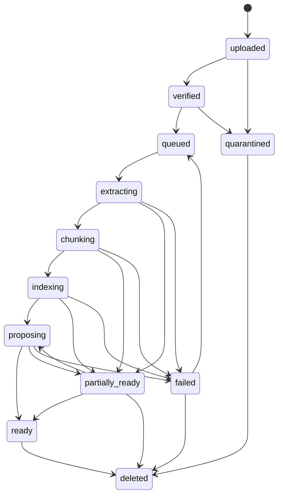
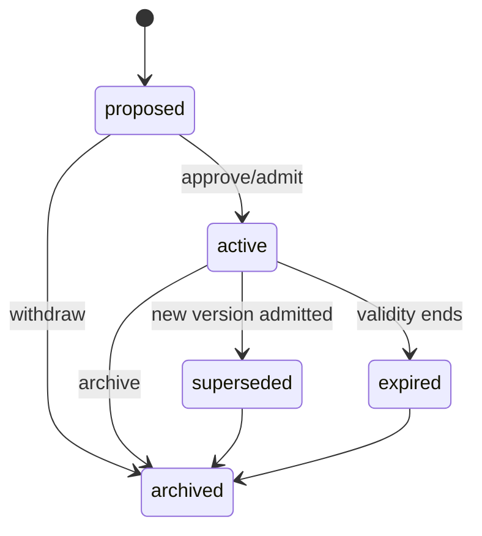
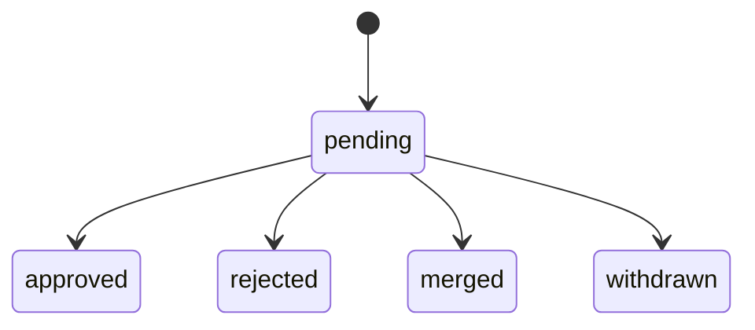
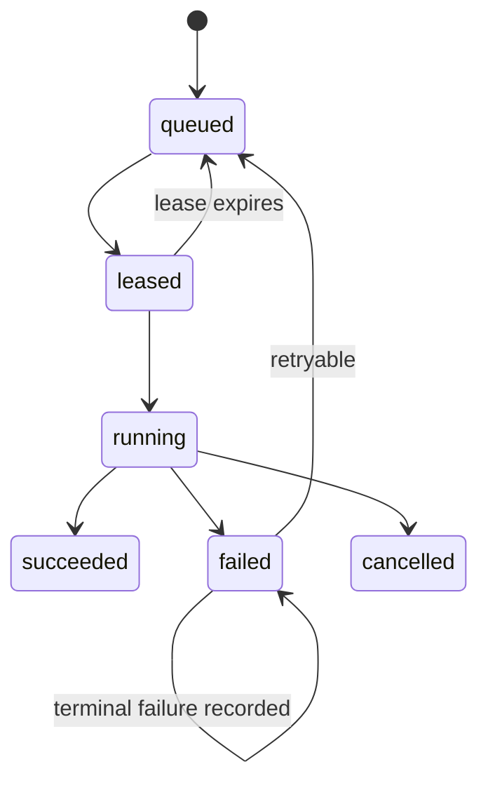
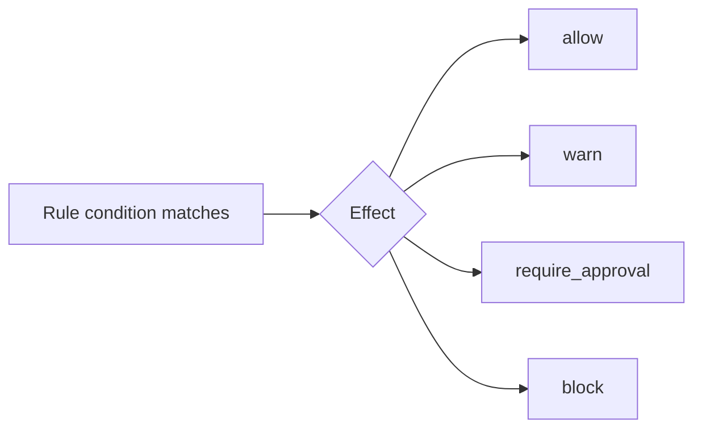

# Phase A Domain Object Catalog — Tenancy, Access, Content, and Evidence

This catalog is the Phase A contract for the A4 and A5 object families. It
defines identity, ownership, lifecycle, mutation authority, event behavior,
versioning, and concurrency before persistence or service behavior is built.

## Contract-wide rules

- Every tenant-owned object carries an immutable `tenant_id`; tenant scope is
  part of every repository command and authorization decision.
- IDs are opaque UUIDv7 newtypes. Slugs, names, filenames, and external keys are
  presentation or lookup metadata, never security boundaries.
- Mutations are idempotent within the command's documented scope and emit an
  immutable event in the same transaction as the state change.
- Optimistic concurrency uses a version token. A stale token returns a conflict
  and does not merge silently.
- PostgreSQL is canonical for structured state. Object bytes are addressed by
  stable IDs and stored through the object-store port; derived artifacts and
  indexes are rebuildable.

## A4 — Tenancy and access

| Object | Identity | Lifecycle | Ownership boundary | Who may mutate | Events emitted | Versioned? | Idempotency and concurrency |
|---|---|---|---|---|---|---|---|
| **Tenant** | `tenant_id` (immutable UUIDv7) | `provisioning` → `active` → `suspended` → `deleting` → `deleted`; provisioning may `failed` | Platform tenancy boundary; all customer rows belong to one tenant | Provisioning workflow; authorized Enterprise Admin may suspend/reactivate | `tenant.provisioned`, `tenant.activated`, `tenant.suspended`, `tenant.deleted` | Yes, for mutable policy/config; identity never changes | Provision by idempotency key scoped to caller; version token required for status/config changes |
| **Actor** | `actor_id`; external subject is unique only within issuer | `active` → `disabled` → `deleted` | Tenant-owned human or service principal record | Tenant administrator; identity sync may update external metadata | `actor.created`, `actor.updated`, `actor.disabled` | Yes | Upsert by `(issuer, subject, tenant_id)`; stale updates conflict |
| **Membership** | `(tenant_id, actor_id)` | `invited` → `active` → `suspended` → `removed` | Tenant membership; does not itself grant Area access | Enterprise Admin or delegated tenant administrator | `membership.invited`, `membership.activated`, `membership.suspended`, `membership.removed` | Yes | Invite/activate/remove commands are idempotent per tenant and actor; one active membership is enforced |
| **Role** | `role_id`; built-in role key or tenant-owned custom key | `draft` → `active` → `retired` | Tenant policy object; built-ins are platform-defined | Platform for built-ins; authorized tenant administrator for custom roles | `role.created`, `role.activated`, `role.retired` | Yes | Mutations keyed by role ID and version token; retiring a role is idempotent |
| **AgentIdentity** | `agent_identity_id`; credential subject is unique within tenant | `registered` → `active` → `rotated` → `revoked` | Tenant-owned machine identity with explicit scopes | Tenant administrator or delegated security administrator | `agent.registered`, `agent.rotated`, `agent.revoked` | Yes; secret material is never versioned into plaintext | Register/rotate/revoke are idempotent by command key; credential rotation uses stale-token rejection |
| **Area** | `area_id` within `tenant_id`; slug is mutable metadata | `provisioning` → `active` → `archived` → `deleted`; may `failed` | Bounded cognitive and authorization context inside a tenant | Area Admin for content policy; tenant administrator for lifecycle | `area.created`, `area.activated`, `area.archived`, `area.deleted` | Yes; every structured object points to a Map version | Create/provision is idempotent by tenant and request key; lifecycle updates require version token |
| **AreaGrant** | `grant_id`; uniqueness by `(area_id, principal, scope)` for active grants | `pending` → `active` → `expired` / `revoked` | Authorization edge from tenant actor/agent to one Area | Area Admin or authorized tenant administrator | `area_grant.created`, `area_grant.changed`, `area_grant.revoked`, `area_grant.expired` | Yes, with effective interval | Grant mutation is idempotent by subject/scope/request key; overlapping active grants are rejected; stale revocation conflicts |
| **Placement** | `placement_id`; tenant has one current placement pointer | `planned` → `provisioning` → `active` → `draining` → `migrated` / `failed` | Infrastructure routing record for a tenant; not customer content | Provisioning service; platform operator under explicit operational authority | `placement.planned`, `placement.activated`, `placement.draining`, `placement.migrated`, `placement.failed` | Yes | Provisioning is an idempotent Operation; current-placement compare-and-swap prevents split ownership |

### Access invariant

Authentication identifies an actor or agent; it does not grant data access. An
authorization decision is the conjunction of tenant membership, enterprise
role, Area grant, object visibility, purpose, and applicable Rules. Platform
operators have no implicit customer-content permission.

## A5 — Content and evidence

| Object | Identity | Lifecycle | Ownership boundary | Who may mutate | Events emitted | Versioned? | Idempotency and concurrency |
|---|---|---|---|---|---|---|---|
| **Source** | `source_id` within `tenant_id` and `area_id`; external locator is metadata | `active` → `superseded` → `deleted`; may be `quarantined` | Original evidence or stable reference owned by an Area | Area-authorized human, connector, or upload workflow; deletion remains policy-controlled | `source.created`, `source.superseded`, `source.quarantined`, `source.deleted` | Yes, through SourceVersion; original evidence is retained until governed deletion | Create is idempotent by source locator/content identity within Area; lifecycle changes use version token |
| **SourceVersion** | `(source_id, version_number)` plus content hash | `uploaded` → `verified` → `current` → `superseded` / `quarantined` / `deleted` | Immutable snapshot belonging to a Source | Ingestion workflow; authorized deletion workflow | `source_version.uploaded`, `source_version.verified`, `source_version.superseded`, `source_version.quarantined` | Yes, append-only; content hash and bytes never mutate | Completion is idempotent by upload intent and checksum; one current pointer uses compare-and-swap |
| **Artifact** | `artifact_id`; derived from SourceVersion, processor identity/version, and input hash | `created` → `available` → `stale` → `deleted`; may be `failed` | Regenerable output owned by the SourceVersion's Area | Worker processor; deletion/rebuild workflow | `artifact.created`, `artifact.available`, `artifact.stale`, `artifact.deleted` | Yes by processor/config/input fingerprint; artifacts are never overwritten | Same derivation key returns the existing artifact; stale worker writes are rejected by input fingerprint |
| **Chunk** | `chunk_id`; deterministic tuple `(source_version_id, representation, coordinate, content_hash)` | `created` → `indexed` → `stale` → `deleted` | Searchable evidence span owned by a SourceVersion | Chunking/indexing workers; governed deletion workflow | `chunk.created`, `chunk.indexed`, `chunk.stale`, `chunk.deleted` | Yes through its SourceVersion and extraction representation | Deterministic upsert by identity tuple; index writes require matching artifact/input version |
| **Entity** | `entity_id` stable within `(tenant_id, area_id)`; names and aliases are attributes | `proposed` → `active` → `merged` / `retired` | Area-local semantic identity; no automatic cross-Area merge | Proposal/review workflow; authorized Area user for approved edits | `entity.proposed`, `entity.approved`, `entity.merged`, `entity.retired` | Yes; Map version records interpretation | Candidate creation deduplicates by proposal key; merges use version token and preserve lineage |
| **Relationship** | `relationship_id`; `(source_entity, relation_kind, target_entity, map_version)` is a constrained logical key | `proposed` → `active` → `superseded` / `rejected` / `retired` | Area-local typed edge; origin and trust are explicit | Proposal/review workflow; authorized Area user for approved edits | `relationship.proposed`, `relationship.approved`, `relationship.superseded`, `relationship.rejected` | Yes; Map version and edge version are retained | Same candidate key is idempotent; concurrent approval/rejection is resolved by version token |
| **Map** | `(area_id, map_version_id)`; monotonically increasing version number | `draft` → `published` → `retired` | Versioned semantic contract owned by an Area | Area Admin; publication may require policy approval | `map.created`, `map.published`, `map.retired` | Yes, immutable after publication | Draft edits use version token; publish is idempotent and only one current version may exist |
| **Cross-Map mapping** | `mapping_id`; endpoints include source/target Area and Map versions | `proposed` → `active` → `superseded` / `blocked` / `revoked` | Explicit registry between Areas; never collapses Area-local records | Agent or user may propose; authorized reviewers activate/block | `cross_map.proposed`, `cross_map.activated`, `cross_map.blocked`, `cross_map.revoked` | Yes; endpoint Map versions and validity interval are retained | Proposal is idempotent by endpoint/type/provenance key; activation uses version token and permission recheck |

### Evidence and trust invariants

- A SourceVersion is evidence; an Artifact is a regenerable interpretation of
  evidence; a Chunk is a coordinate-bearing searchable span of that
  interpretation.
- Entity and Relationship are Area-local semantic records. Their origin must
  remain one of `observed`, `inferred`, `proposed`, or `approved`; origin is not
  interchangeable with lifecycle state or trust.
- Map versions give structured records meaning at a point in time. A new Map
  version does not silently reinterpret existing records.
- Cross-Map mappings preserve both Area labels and endpoint Map versions.
  Traversal is permission-filtered before expansion, and `same_identity` is
  reversible without deleting either Area-local record.

## Source ingestion state machine

### State semantics

| State | Meaning and required evidence |
|---|---|
| `uploaded` | Upload intent completed; bytes are held under the expected tenant-scoped key but are not trusted. |
| `verified` | Declared/detected media type, size, checksum, ownership, and safety limits passed. |
| `queued` | A durable Operation/Job exists; no processor has claimed it yet. |
| `extracting` | A processor lease is active; processor version, config fingerprint, input hash, and warnings are recorded. |
| `chunking` | Extraction outputs are being converted into deterministic coordinate-bearing Chunks. |
| `indexing` | Search projections are being written; PostgreSQL remains canonical. |
| `proposing` | Candidate entities, relationships, claims, or decisions are being generated and validated. |
| `ready` | Required processing completed and the UI may represent the Source as fully available. |
| `partially_ready` | Searchable or inspectable outputs exist, but optional or failed stages remain visible and actionable. |
| `failed` | Processing stopped with a recorded retryable or terminal error; original bytes remain intact. |
| `quarantined` | Input or processing result is unsafe/suspicious and cannot enter normal processing until governed action. |
| `deleted` | Access is revoked and canonical metadata is tombstoned according to retention policy; derived projections are removed. |

Every transition is an authorized, idempotent command, emits an event in the
same transaction, and records the processor/operation evidence needed for
replay. Reprocessing creates new derived Artifacts and Chunks while preserving
the original SourceVersion.

## A4/A5 evidence checklist

- 16 catalog rows are complete across the two session families.
- Tenant, role, agent identity, Area grant, Map, and Cross-Map identities are
  explicit and tenant/Area scoped.
- Source, SourceVersion, Artifact, and Chunk remain distinct by identity and
  lifecycle; evidence is not confused with derived output or claim.
- The ingestion state machine includes all required normal, partial, failure,
  quarantine, retry, and deletion paths.

## A6 — Governance, decisions, and operations

| Object | Identity | Lifecycle | Ownership boundary | Who may mutate | Events emitted | Versioned? | Idempotency and concurrency |
|---|---|---|---|---|---|---|---|
| **Memory** | `memory_id` within `(tenant_id, area_id)` | `proposed` → `active` → `superseded` / `expired` / `archived` | Durable governed claim owned by an Area | Proposal/review workflow; authorized user may edit through a new version | `memory.proposed`, `memory.activated`, `memory.superseded`, `memory.expired`, `memory.archived` | Yes; current version pointer plus immutable lineage | Exact duplicate reuses the logical Memory; semantic duplicates/contradictions require review; stale writes return current state |
| **MemoryVersion** | `(memory_id, version_number)` and normalized content hash | `draft` → `current` → `superseded` / `rejected` | Immutable claim version with applicability, validity, attribution, and evidence references | Created only by governed write/review commands | `memory_version.created`, `memory_version.committed`, `memory_version.superseded` | Yes, append-only | Same normalized claim/scope is idempotent; current-pointer update is compare-and-swap |
| **EvidenceLink** | `evidence_link_id`; unique `(memory_version_id, evidence target, span)` | `proposed` → `attached` → `withdrawn` | Link from a governed claim to SourceVersion/Chunk evidence | Proposal/review workflow; withdrawal requires authorization | `evidence_link.proposed`, `evidence_link.attached`, `evidence_link.withdrawn` | Yes, attribution and evidence coordinates are retained | Duplicate links collapse by deterministic key; withdrawal uses version token |
| **Proposal** | `proposal_id` within tenant and Area | `pending` → `approved` / `rejected` / `merged` / `withdrawn` | Review boundary between observation and durable claim/policy | Agent or processor may propose; reviewer or explicit policy decides | `proposal.created`, `proposal.approved`, `proposal.rejected`, `proposal.merged`, `proposal.withdrawn` | Yes; decision and rejection reason are retained | Proposal creation keyed by source/run/content hash; only one terminal decision wins under optimistic concurrency |
| **Rule** | `rule_id` within `(tenant_id, area_id)` | `draft` → `active` → `superseded` / `disabled` | Enforceable policy evaluated outside the language model | Area Admin or governance administrator | `rule.created`, `rule.activated`, `rule.superseded`, `rule.disabled` | Yes; immutable RuleVersion records effect and condition | Publish/disable is idempotent; active version pointer uses compare-and-swap |
| **Event** | `event_id` globally unique; aggregate and sequence identify its stream position | `appended` → `retained` / `redacted` according to policy | Immutable tenant decision ledger and audit record | Append-only by the transaction that changes a domain object; no ordinary update/delete | `event.appended` (the event itself) | No mutation; schema version and payload classification are retained | Idempotency key and aggregate sequence prevent duplicate appends; transaction commit is atomic with the described change |
| **Operation/Job** | `operation_id`; idempotency key is unique within command scope | `queued` → `leased` → `running` → `succeeded` / `failed` / `cancelled` | Tenant-owned long-running work record; queue adapter is replaceable | API creates/cancels; worker leases, renews, retries, and completes | `operation.queued`, `operation.leased`, `operation.started`, `operation.succeeded`, `operation.failed`, `operation.cancelled` | Yes; attempt, lease, and retry history are retained | Submission is idempotent by scoped key; lease renewal and completion require lease token; expired leases may be safely reclaimed |
| **AI Run** | `ai_run_id` within tenant; one bounded agent task | `started` → `running` → `completed` / `failed` / `cancelled` / `replayed` | Tenant-owned product and governance record | Agent runtime creates; system records spans/outcome; authorized reviewer may annotate | `ai_run.started`, `ai_run.completed`, `ai_run.failed`, `ai_run.cancelled`, `ai_run.replayed` | Yes; model, prompt, tool, Map, Rule, and context references are immutable per run | Start is idempotent by session/task key; terminal transition is compare-and-swap; replay creates a linked new run |
| **Decision Envelope** | `decision_envelope_id`; one immutable envelope per AI Run decision | `captured` → `sealed` → `replayed` / `superseded` (record remains) | Tenant decision trace containing resolved context, evidence, policy, action, uncertainty, and outcome | Runtime seals it; governance users may append correction/feedback, never rewrite captured facts | `decision_envelope.captured`, `decision_envelope.sealed`, `decision_envelope.replayed`, `decision_envelope.corrected` | Yes; schema/version references and classified snapshot pointers are retained | Capture is idempotent by AI Run and decision stage; sealing is one-way and guarded by run version |

## Disambiguation matrix

| Object | What it is | Identity built from | Evidence or claim? | Canonical or regenerable? | Who can create it? | Trust/origin |
|---|---|---|---|---|---|---|
| **Source** | Original evidence or stable external reference | Tenant, Area, Source ID; locator/content identity is metadata | Evidence boundary | Canonical metadata and retained original reference | Authorized human, connector, or upload workflow | Untrusted until verified; provenance is preserved |
| **Chunk** | Coordinate-bearing searchable span derived from a SourceVersion | SourceVersion, representation, coordinate, content hash | Evidence projection | Regenerable | Chunking worker | Inherits Source provenance; never a claim by itself |
| **Entity** | Area-local semantic identity for a person, account, concept, or other Map kind | Tenant, Area, Entity ID; aliases are attributes | Observed/inferred semantic record, not durable claim text | Canonical identity; projections may be rebuilt | Proposal/review workflow or authorized Area user | Origin explicitly `observed`, `inferred`, `proposed`, or `approved` |
| **Memory** | Durable governed claim with applicability, validity, attribution, and lineage | Tenant, Area, Memory ID; current version points to content | Claim | Canonical claim plus rebuildable retrieval projection | Proposal/review workflow or explicitly authorized command | Admission state and origin are separate; active does not mean equally trusted |
| **Proposal** | Reviewable candidate at the boundary between evidence and durable state | Proposal ID plus source/run/content hash | Candidate claim, relation, rule, or Map change | Canonical review record; derived payload may be regenerated with provenance | Agent, processor, or user | Proposed only until an explicit approval; rejection reason is retained |
| **Rule** | Enforceable policy evaluated outside the model | Tenant, Area, Rule ID and immutable RuleVersion | Policy/constraint, not evidence | Canonical versioned policy | Authorized governance administrator | Authority comes from scope and approval, not from Source or model output |

The matrix is normative: no API or persistence model may collapse these six
objects into a generic “record,” and no graph edge may imply equal trust merely
because its endpoints are both present.

## Remaining state machines

### Memory lifecycle

Every superseding version points to its predecessor and records the reason;
historical queries can reconstruct the version active at a past time.

### Proposal review

Rejection is terminal for that proposal and retains a structured reason,
reviewer, policy result, and evidence context as evaluation data.

### Operation/Job

Leases have an owner and expiry. A worker may renew only its lease; completion
with an expired lease is rejected. Retry attempts are recorded, and handlers
must be safe to replay.

### Rule effect

`allow`, `warn`, `require_approval`, and `block` are the complete Phase A
effect vocabulary. A model cannot downgrade a `block` or bypass a required
approval.

### AI Run and Decision Envelope

An AI Run records the bounded task and its operational trace. Its Decision
Envelope is sealed once the resolved context, evidence, Rules, action, and
uncertainty are captured. Replay never repeats external side effects by
default; it creates a linked run and envelope instead.

## A6 evidence checklist

- Governance catalog covers Memory, MemoryVersion, EvidenceLink, Proposal,
  Rule, Event, Operation/Job, AI Run, and Decision Envelope.
- The disambiguation matrix makes Source, Chunk, Entity, Memory, Proposal, and
  Rule distinct by identity, provenance, regeneration, and trust.
- Memory, Proposal, Operation/Job, and Rule effect state machines are explicit;
  AI Run and Decision Envelope immutability/replay rules are recorded.
