# 23 — Architecture Diagrams

> Source: SMASH_V2.md §24

**These diagrams are part of the implementation contract. Update them when a service boundary or data responsibility changes.**

## 24.1 System context: Sources to governed Memory to agents

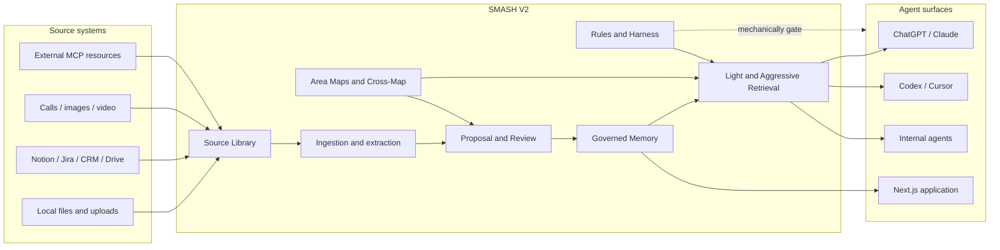

## 24.2 Community Edition Docker Compose architecture

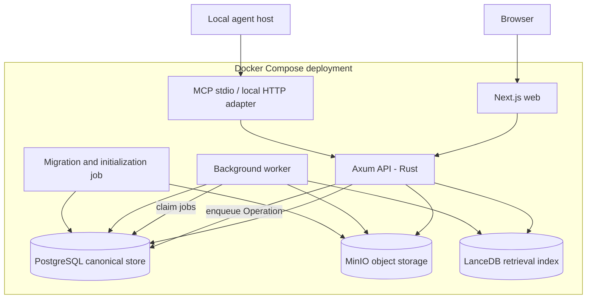

## 24.3 Managed-service evolution after Community Edition

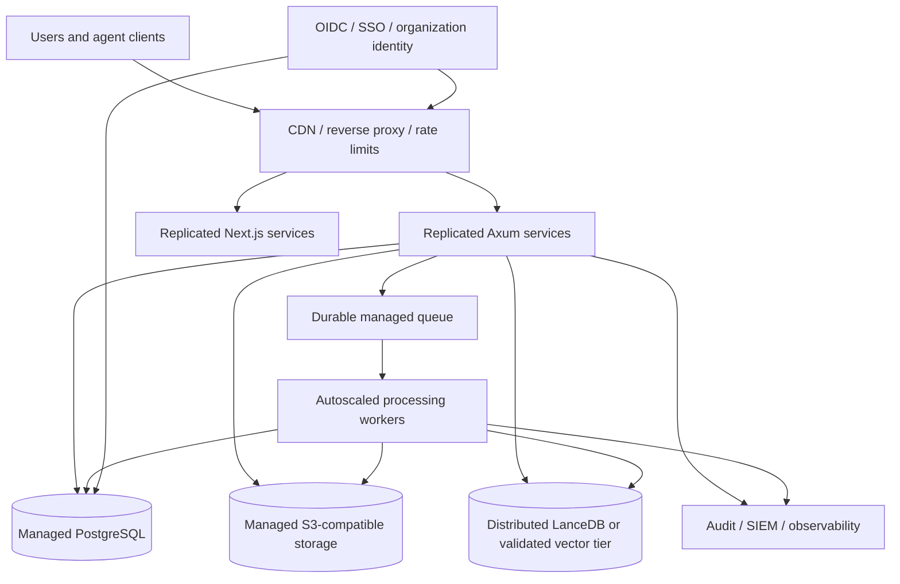

## 24.4 Canonical data and projection relationship

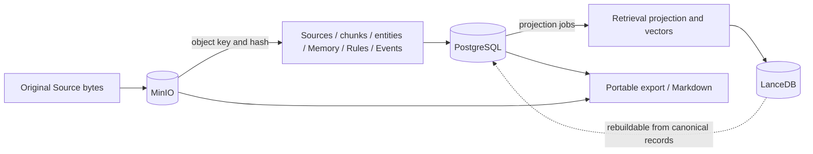

## 24.5 Source ingestion pipeline

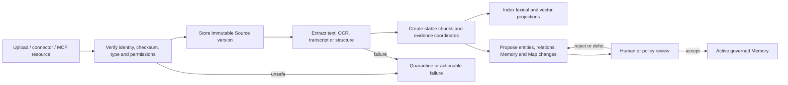

## 24.6 Memory proposal and upsert decision graph

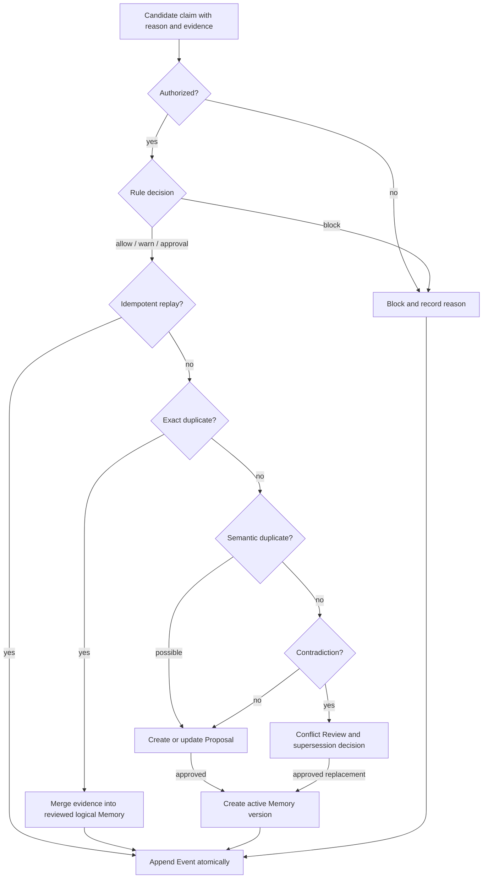

## 24.7 Light and Aggressive retrieval router

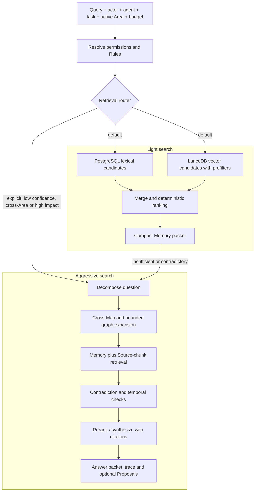

## 24.8 Area Maps and Cross-Map architecture

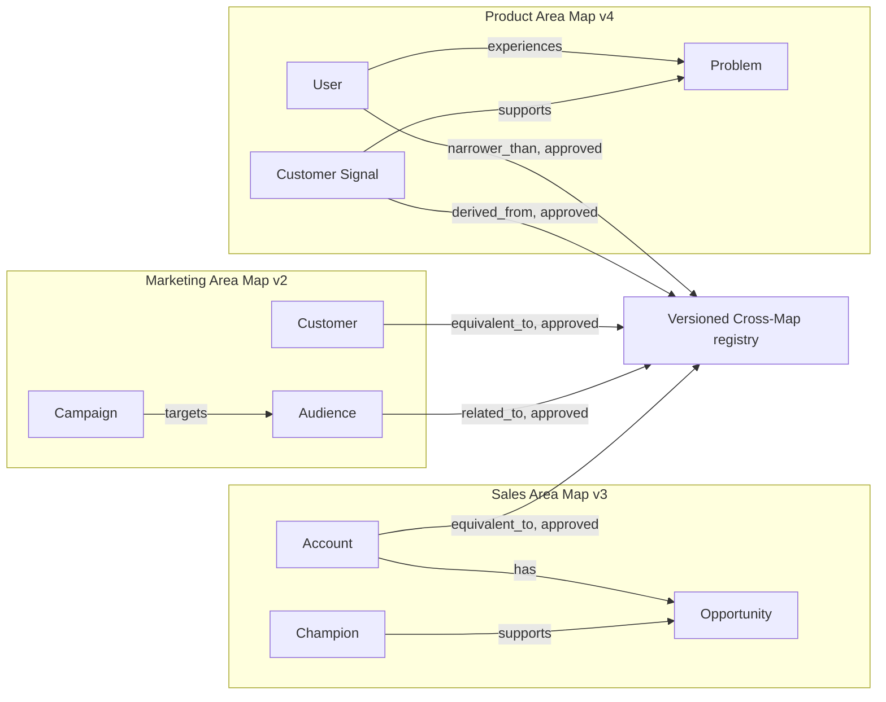

## 24.9 Rule harness around agent actions

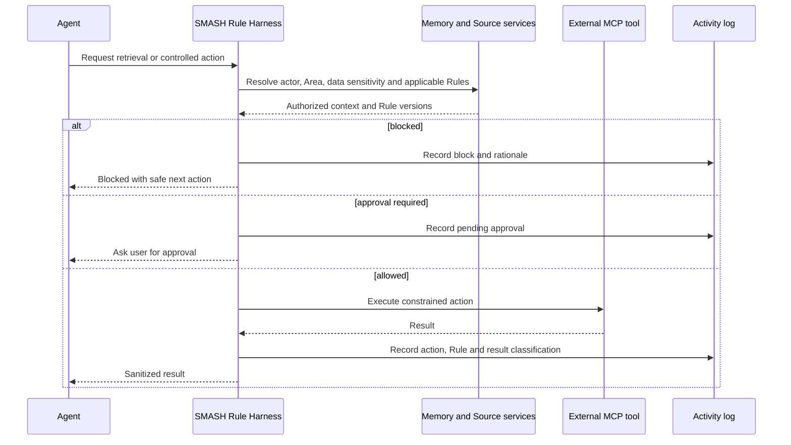

## 24.10 Agent session and memory loop

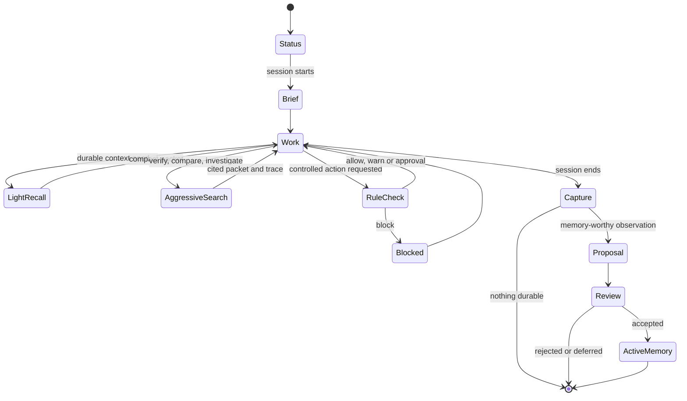

## 24.11 MCP server, consumer, skills, prompts, and registry

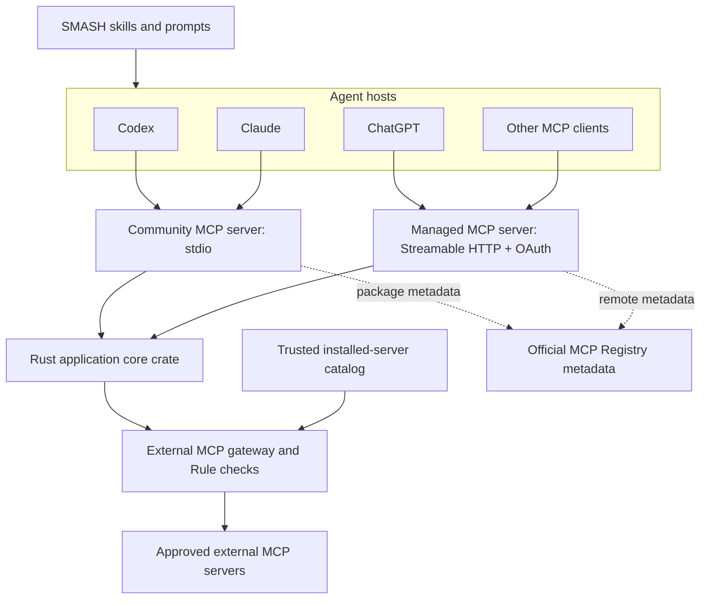

## 24.12 High-level relational model

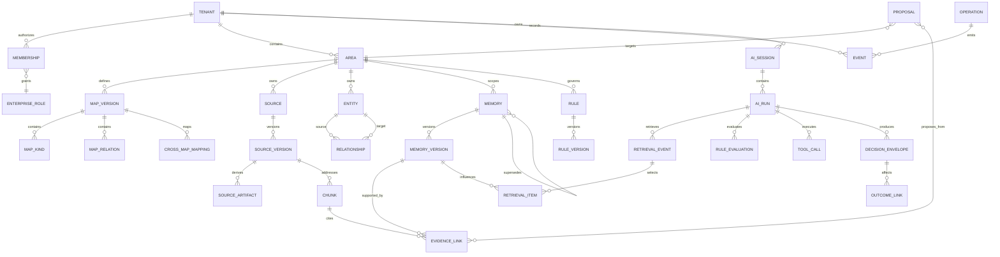

## 24.13 Managed tenant topology

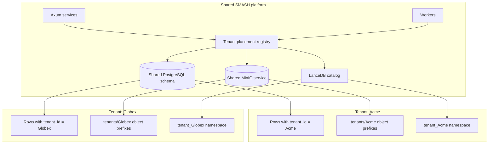

## 24.14 Tenant provisioning state machine

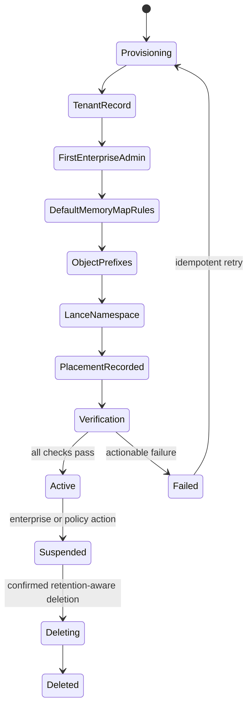

## 24.15 Enterprise role and access model

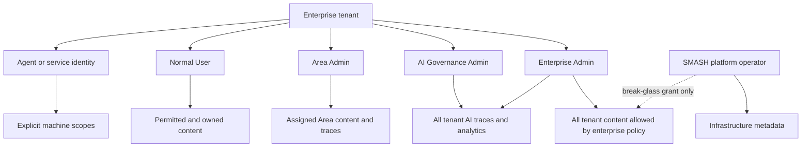

## 24.16 AI decision trace, replay, and outcome graph

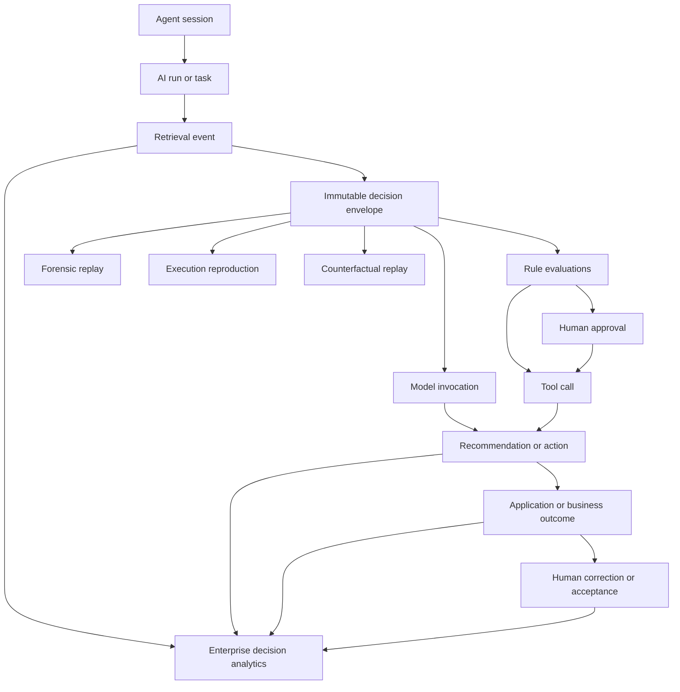
