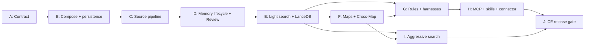

# 19 — Implementation Phases Without Timelines

> Source: the historical roadmap source §20

**Each phase is a capability gate.** Do not begin a later phase merely because work has started; begin it when the previous phase's invariants and acceptance criteria are met.

Parallel experimentation is allowed, but the main branch preserves a coherent product.

## Phase overview

| Phase | Name | Delivers | Detail |
|---|---|---|---|
| **A** | Contract and workspace foundation | Terminology, domain schemas, API conventions, event model, ADRs, the canonical Sales fixture | [phase-a](phases/phase-a-contract-and-workspace-foundation.md) |
| **B** | Docker Compose and canonical persistence | Reproducible stack; PostgreSQL + MinIO canonical persistence | [phase-b](phases/phase-b-compose-and-canonical-persistence.md) |
| **C** | Source pipeline and worker reliability | Operations/jobs, extraction, artifacts, stable chunks, quarantine | [phase-c](phases/phase-c-source-pipeline-and-worker.md) |
| **D** | Memory lifecycle and Review | Proposals, duplicates, contradictions, review, supersession, Review UI | [phase-d](phases/phase-d-memory-lifecycle-and-review.md) |
| **E** | Light search and LanceDB | Lexical + vector retrieval, projections, prefilters, reconciliation, benchmarks | [phase-e](phases/phase-e-light-search-and-lancedb.md) |
| **F** | Maps, graph, and Cross-Map | Versioned Maps, entity identity, bounded graph, Cross-Map mappings | [phase-f](phases/phase-f-maps-graph-and-cross-map.md) |
| **G** | Rules and harnesses | Declarative Rule engine, pre-tool gateway, the killer demo | [phase-g](phases/phase-g-rules-and-harnesses.md) |
| **H** | MCP, skills, prompts, and one connector | Slim MCP adapter, session skills/prompts, first native connector | [phase-h](phases/phase-h-mcp-skills-prompts-connector.md) |
| **I** | Aggressive search | Multi-step investigation, budgets, citations, traces | [phase-i](phases/phase-i-aggressive-search.md) |
| **J** | Community Edition release gate | Installable, documented, backed-up, upgradeable release | [phase-j](phases/phase-j-community-edition-release-gate.md) |

## Dependency shape

## After Phase J

See [20 — Post-Community managed service focus](20-managed-service.md).
